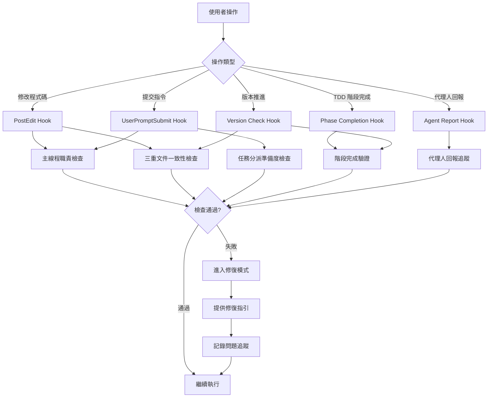

# 🚀 敏捷重構方法論 Hook 系統實作規格

## 📖 文件資訊

- **版本**: v1.0
- **建立日期**: 2025-10-09
- **責任人**: rosemary-project-manager
- **依據方法論**: [敏捷重構方法論 v1.2]($CLAUDE_PROJECT_DIR/.claude/methodologies/agile-refactor-methodology.md)
- **目標**: 透過 Hook 系統自動化強制執行敏捷重構規範，防止人為違規

## 🎯 Hook 系統目標

### 核心目標
1. **防止主線程違規** - 主線程禁止親自修改程式碼，只能分派任務
2. **強制準備度檢查** - 任務分派前必須通過完整準備度檢查清單
3. **確保文件一致性** - 三重文件（CHANGELOG/todolist/work-log）保持同步
4. **強制階段驗證** - 每個開發階段必須通過完整驗證檢查清單
5. **追蹤問題閉環** - 代理人回報的問題必須追蹤到解決完成

### 自動化範圍
- ✅ **自動檢測** - Hook 系統自動檢測違規行為
- ✅ **自動提醒** - 發現問題立即提醒並提供修復指引
- ✅ **自動記錄** - 所有檢查結果記錄到日誌檔案
- ⚠️ **修復模式** - 違規時進入修復模式，允許修正後繼續

---

## 🔧 Hook 1: 主線程職責檢查 (Main Thread Responsibility Check)

### 目的
防止主線程親自修改程式碼，確保主從分工原則執行。

### 觸發時機
- **PostEdit Hook** - 任何程式碼檔案修改後
- **UserPromptSubmit Hook** - 使用者提交指令時

### 檢查邏輯

#### 違規行為定義
```bash
# 主線程違規行為偵測
1. 直接修改 lib/ 目錄下的 .dart 檔案
2. 使用 Edit/Write 工具修改程式碼
3. 執行程式碼相關的 Bash 指令（如編譯、格式化）

# 允許的行為
1. 讀取檔案 (Read 工具)
2. 搜尋檔案 (Grep/Glob 工具)
3. 分派任務 (Task 工具)
4. 更新文件 (docs/ 目錄)
5. 更新 Hook 系統 (.claude/ 目錄)
```

### 實作規格

#### 檢查腳本: `.claude/hooks/main-thread-responsibility-check.sh`

```bash
#!/bin/bash

# 主線程職責檢查 Hook
# 目的: 防止主線程親自修改程式碼

# 載入專案通用函數
SCRIPT_DIR="$(cd "$(dirname "${BASH_SOURCE[0]}")" && pwd)"
source "$SCRIPT_DIR/common-functions.sh"

# 設定專案環境
if ! setup_project_environment; then
    echo "錯誤: 無法設定專案環境" >&2
    exit 1
fi

# 日誌檔案
LOG_FILE="$CLAUDE_LOGS_DIR/main-thread-responsibility-$(date +%Y%m%d).log"

# 檢查是否為主線程操作
check_main_thread_violation() {
    local operation_type="$1"
    local target_file="$2"

    # 檢查是否修改程式碼檔案
    if [[ "$target_file" =~ ^lib/.*\.dart$ ]]; then
        echo "⚠️  主線程違規偵測: 嘗試修改程式碼檔案" | tee -a "$LOG_FILE"
        echo "   檔案: $target_file" | tee -a "$LOG_FILE"
        echo "   操作: $operation_type" | tee -a "$LOG_FILE"

        # 進入修復模式
        enter_fix_mode "main-thread-violation" "$target_file"
        return 1
    fi

    return 0
}

# 進入修復模式
enter_fix_mode() {
    local violation_type="$1"
    local target_file="$2"

    echo "" | tee -a "$LOG_FILE"
    echo "🚨 進入修復模式 - 主線程職責違規" | tee -a "$LOG_FILE"
    echo "" | tee -a "$LOG_FILE"
    echo "📋 違規說明:" | tee -a "$LOG_FILE"
    echo "   - 主線程禁止親自修改程式碼" | tee -a "$LOG_FILE"
    echo "   - 程式碼修改必須分派給專業 agent 執行" | tee -a "$LOG_FILE"
    echo "" | tee -a "$LOG_FILE"
    echo "✅ 正確做法:" | tee -a "$LOG_FILE"
    echo "   1. 使用 Task 工具分派任務給專業 agent" | tee -a "$LOG_FILE"
    echo "   2. 例如: mint-format-specialist (格式化)" | tee -a "$LOG_FILE"
    echo "   3. 例如: pepper-test-implementer (實作)" | tee -a "$LOG_FILE"
    echo "   4. 例如: cinnamon-refactor-owl (重構)" | tee -a "$LOG_FILE"
    echo "" | tee -a "$LOG_FILE"
    echo "📖 參考文件:" | tee -a "$LOG_FILE"
    echo "   - 敏捷重構方法論: .claude/methodologies/agile-refactor-methodology.md" | tee -a "$LOG_FILE"
    echo "   - 主線程職責: 只負責分派和統籌，禁止親自執行程式碼修改" | tee -a "$LOG_FILE"
    echo "" | tee -a "$LOG_FILE"

    # 記錄違規到問題追蹤
    echo "- [ ] 主線程職責違規: 嘗試修改 $target_file ($(date +%Y-%m-%d))" >> "$CLAUDE_LOGS_DIR/issues-to-track.md"
}

# 主檢查邏輯
main() {
    echo "[$(date +%Y-%m-%d\ %H:%M:%S)] 🔍 主線程職責檢查 Hook: 開始執行" | tee -a "$LOG_FILE"

    # 檢查最近的操作
    # 這裡需要整合到 PostEdit Hook 和 UserPromptSubmit Hook
    # 具體實作依據 Hook 系統觸發機制

    echo "[$(date +%Y-%m-%d\ %H:%M:%S)] ✅ 主線程職責檢查 Hook: 執行完成" | tee -a "$LOG_FILE"
}

# 執行主程式
main "$@"
```

### 整合點
- 整合到 **PostEdit Hook** - 檔案修改後立即檢查
- 整合到 **UserPromptSubmit Hook** - 使用者提交指令時檢查操作類型

---

## 🔧 Hook 2: 任務分派準備度檢查 (Task Dispatch Readiness Check)

### 目的
確保任務分派前已完成完整準備度檢查清單，包含參考文件和影響範圍。

### 觸發時機
- **Pre-Task-Dispatch Hook** - 使用 Task 工具分派任務前
- **UserPromptSubmit Hook** - 偵測到分派任務關鍵字時

### 檢查邏輯

#### 準備度檢查清單（對應方法論第 79-141 行）

```markdown
## 準備度檢查問題

### 1. 明確的文件規劃
- [ ] API 規格是否完整？
- [ ] 設計文件是否具體？
- [ ] 架構圖是否清晰？

### 2. 測試先行策略
- [ ] 測試規格是否存在？
- [ ] TDD 流程是否明確？
- [ ] 效能標準是否定義？

### 3. 實作目標明確性
- [ ] 完成標準是否可測量？
- [ ] 使用範例是否充足？
- [ ] 移轉策略是否清楚？

### 4. 風險評估與應對
- [ ] 潛在問題是否識別？
- [ ] 回滾計畫是否準備？
- [ ] 依賴關係是否梳理？

### 5. 參考文件和影響範圍完整性（強制）⚠️
- [ ] UseCase 參考是否明確？
- [ ] 流程圖 Event 是否具體？
- [ ] 架構規範是否引用？
- [ ] 依賴類別是否列舉？
- [ ] 測試設計是否參考？
- [ ] 影響檔案是否清單化？
- [ ] 影響範圍是否評估？

### 6. 設計面效能考量（強制）⚠️
- [ ] 效能瓶頸是否識別？
- [ ] 優化策略是否規劃？
- [ ] 資源使用是否評估？
- [ ] UI 阻塞是否避免？（前端）
- [ ] 回應時間是否設計？（後端）
- [ ] 效能基準是否設定？
```

### 實作規格

#### 檢查腳本: `.claude/hooks/task-dispatch-readiness-check.sh`

```bash
#!/bin/bash

# 任務分派準備度檢查 Hook
# 目的: 確保任務分派前完成準備度檢查清單

# 載入專案通用函數
SCRIPT_DIR="$(cd "$(dirname "${BASH_SOURCE[0]}")" && pwd)"
source "$SCRIPT_DIR/common-functions.sh"

# 設定專案環境
if ! setup_project_environment; then
    echo "錯誤: 無法設定專案環境" >&2
    exit 1
fi

# 日誌檔案
LOG_FILE="$CLAUDE_LOGS_DIR/task-dispatch-readiness-$(date +%Y%m%d).log"

# 檢查任務描述是否包含必要參考文件
check_task_documentation() {
    local task_description="$1"
    local missing_items=()

    # 檢查 UseCase 參考
    if ! echo "$task_description" | grep -q "UC-[0-9]\{2\}"; then
        missing_items+=("UseCase 參考")
    fi

    # 檢查流程圖 Event 參考
    if ! echo "$task_description" | grep -q "Event [0-9]"; then
        missing_items+=("流程圖 Event 參考")
    fi

    # 檢查架構規範引用
    if ! echo "$task_description" | grep -q -E "(Clean Architecture|DDD|Domain 層|Application 層)"; then
        missing_items+=("架構規範引用")
    fi

    # 檢查依賴類別列舉
    if ! echo "$task_description" | grep -q -E "(依賴類別|前置任務產出)"; then
        missing_items+=("依賴類別列舉")
    fi

    # 檢查測試設計參考
    if ! echo "$task_description" | grep -q -E "(測試設計|測試檔案|測試用例)"; then
        missing_items+=("測試設計參考")
    fi

    # 檢查影響檔案清單
    if ! echo "$task_description" | grep -q -E "(影響範圍|影響檔案|需要修改)"; then
        missing_items+=("影響檔案清單")
    fi

    # 檢查效能考量
    if ! echo "$task_description" | grep -q -E "(效能|Performance|優化)"; then
        missing_items+=("效能考量")
    fi

    if [ ${#missing_items[@]} -gt 0 ]; then
        return 1
    fi

    return 0
}

# 進入修復模式
enter_fix_mode() {
    local missing_items="$1"

    echo "" | tee -a "$LOG_FILE"
    echo "🚨 進入修復模式 - 任務分派準備度不足" | tee -a "$LOG_FILE"
    echo "" | tee -a "$LOG_FILE"
    echo "📋 缺失項目:" | tee -a "$LOG_FILE"
    echo "$missing_items" | tee -a "$LOG_FILE"
    echo "" | tee -a "$LOG_FILE"
    echo "✅ 修復指引:" | tee -a "$LOG_FILE"
    echo "   1. 補充完整的參考文件章節" | tee -a "$LOG_FILE"
    echo "   2. 明確列出 UseCase、流程圖 Event、依賴類別" | tee -a "$LOG_FILE"
    echo "   3. 評估影響範圍和效能考量" | tee -a "$LOG_FILE"
    echo "   4. 完成後重新分派任務" | tee -a "$LOG_FILE"
    echo "" | tee -a "$LOG_FILE"
    echo "📖 參考範例:" | tee -a "$LOG_FILE"
    echo "   - 參考 docs/work-logs/v0.11.5-a-enrichment-processor.md" | tee -a "$LOG_FILE"
    echo "   - 完整的參考文件格式範例" | tee -a "$LOG_FILE"
    echo "" | tee -a "$LOG_FILE"

    # 記錄違規
    echo "- [ ] 任務分派準備度不足: 缺失 $missing_items ($(date +%Y-%m-%d))" >> "$CLAUDE_LOGS_DIR/issues-to-track.md"
}

# 主檢查邏輯
main() {
    echo "[$(date +%Y-%m-%d\ %H:%M:%S)] 🔍 任務分派準備度檢查 Hook: 開始執行" | tee -a "$LOG_FILE"

    # 檢查最近的任務描述
    # 這裡需要整合到 Pre-Task-Dispatch Hook
    # 具體實作依據 Hook 系統觸發機制

    echo "[$(date +%Y-%m-%d\ %H:%M:%S)] ✅ 任務分派準備度檢查 Hook: 執行完成" | tee -a "$LOG_FILE"
}

# 執行主程式
main "$@"
```

### 整合點
- 新建 **Pre-Task-Dispatch Hook** - Task 工具使用前觸發
- 整合到 **UserPromptSubmit Hook** - 偵測分派任務關鍵字

---

## 🔧 Hook 3: 三重文件一致性檢查 (Triple Document Consistency Check)

### 目的
確保 CHANGELOG.md、todolist.md、work-logs/ 三重文件保持一致性。

### 觸發時機
- **PostEdit Hook** - 任何三重文件修改後
- **Version Check Hook** - 版本推進檢查時
- **定期檢查** - 每日執行一次完整檢查

### 檢查邏輯

#### 一致性檢查項目（對應方法論第 395-420 行）

```markdown
## 強制檢查項目

### 版本號一致性
- CHANGELOG 版本號 = work-log 主版本號
- todolist 版本系列 = work-log 版本系列

### 任務狀態一致性
- todolist 標記完成 ⇒ work-log 必須有對應完成記錄
- work-log 標記完成 ⇒ todolist 必須同步更新

### 功能描述一致性
- CHANGELOG 功能描述 ⇒ 必須對應 work-log 實作內容
- 不可在 CHANGELOG 記錄未實作的功能
```

### 實作規格

#### 檢查腳本: `.claude/hooks/triple-document-consistency-check.sh`

```bash
#!/bin/bash

# 三重文件一致性檢查 Hook
# 目的: 確保 CHANGELOG/todolist/work-log 保持同步

# 載入專案通用函數
SCRIPT_DIR="$(cd "$(dirname "${BASH_SOURCE[0]}")" && pwd)"
source "$SCRIPT_DIR/common-functions.sh"

# 設定專案環境
if ! setup_project_environment; then
    echo "錯誤: 無法設定專案環境" >&2
    exit 1
fi

# 日誌檔案
LOG_FILE="$CLAUDE_LOGS_DIR/triple-document-consistency-$(date +%Y%m%d).log"

# 檢查版本號一致性
check_version_consistency() {
    echo "🔍 檢查版本號一致性" | tee -a "$LOG_FILE"

    # 提取 CHANGELOG 最新版本
    local changelog_version=$(grep -E "^## v[0-9]+\.[0-9]+" "$CLAUDE_PROJECT_DIR/CHANGELOG.md" | head -1 | sed -E 's/^## v([0-9]+\.[0-9]+).*/\1/')

    # 提取 work-log 最新主版本
    local latest_worklog=$(ls -1 "$CLAUDE_PROJECT_DIR/docs/work-logs/" | grep -E "^v[0-9]+\.[0-9]+\.0-main\.md$" | sort -V | tail -1)
    local worklog_version=$(echo "$latest_worklog" | sed -E 's/^v([0-9]+\.[0-9]+)\.0-main\.md$/\1/')

    # 比較版本號
    if [ "$changelog_version" != "$worklog_version" ]; then
        echo "⚠️  版本號不一致:" | tee -a "$LOG_FILE"
        echo "   CHANGELOG: v$changelog_version" | tee -a "$LOG_FILE"
        echo "   work-log:  v$worklog_version" | tee -a "$LOG_FILE"
        return 1
    fi

    echo "✅ 版本號一致: v$changelog_version" | tee -a "$LOG_FILE"
    return 0
}

# 檢查任務狀態一致性
check_task_status_consistency() {
    echo "🔍 檢查任務狀態一致性" | tee -a "$LOG_FILE"

    # 提取 todolist 已完成任務
    local completed_tasks=$(grep -E "^\s*- \[x\] v[0-9]+\.[0-9]+\.[0-9]+" "$CLAUDE_PROJECT_DIR/docs/todolist.md" | sed -E 's/.*\[x\] (v[0-9]+\.[0-9]+\.[0-9]+).*/\1/')

    # 檢查每個已完成任務是否有對應 work-log
    local missing_worklogs=()
    for task in $completed_tasks; do
        if ! ls "$CLAUDE_PROJECT_DIR/docs/work-logs/" | grep -q "^$task"; then
            missing_worklogs+=("$task")
        fi
    done

    if [ ${#missing_worklogs[@]} -gt 0 ]; then
        echo "⚠️  任務狀態不一致: 以下任務標記完成但無 work-log" | tee -a "$LOG_FILE"
        printf '   - %s\n' "${missing_worklogs[@]}" | tee -a "$LOG_FILE"
        return 1
    fi

    echo "✅ 任務狀態一致" | tee -a "$LOG_FILE"
    return 0
}

# 進入修復模式
enter_fix_mode() {
    local inconsistency_type="$1"
    local details="$2"

    echo "" | tee -a "$LOG_FILE"
    echo "🚨 進入修復模式 - 三重文件不一致" | tee -a "$LOG_FILE"
    echo "" | tee -a "$LOG_FILE"
    echo "📋 不一致類型: $inconsistency_type" | tee -a "$LOG_FILE"
    echo "   詳細資訊: $details" | tee -a "$LOG_FILE"
    echo "" | tee -a "$LOG_FILE"
    echo "✅ 修復指引:" | tee -a "$LOG_FILE"

    case "$inconsistency_type" in
        "version")
            echo "   1. 檢查 CHANGELOG.md 和 work-log 版本號" | tee -a "$LOG_FILE"
            echo "   2. 確認是否需要發布新版本" | tee -a "$LOG_FILE"
            echo "   3. 同步版本號到三重文件" | tee -a "$LOG_FILE"
            ;;
        "task-status")
            echo "   1. 檢查 todolist 標記完成的任務" | tee -a "$LOG_FILE"
            echo "   2. 確認對應的 work-log 是否存在" | tee -a "$LOG_FILE"
            echo "   3. 補充缺失的 work-log 或修正 todolist" | tee -a "$LOG_FILE"
            ;;
    esac

    echo "" | tee -a "$LOG_FILE"

    # 記錄違規
    echo "- [ ] 三重文件不一致: $inconsistency_type - $details ($(date +%Y-%m-%d))" >> "$CLAUDE_LOGS_DIR/issues-to-track.md"
}

# 主檢查邏輯
main() {
    echo "[$(date +%Y-%m-%d\ %H:%M:%S)] 🔍 三重文件一致性檢查 Hook: 開始執行" | tee -a "$LOG_FILE"

    local has_error=0

    # 檢查版本號一致性
    if ! check_version_consistency; then
        enter_fix_mode "version" "版本號不一致"
        has_error=1
    fi

    # 檢查任務狀態一致性
    if ! check_task_status_consistency; then
        enter_fix_mode "task-status" "任務狀態不同步"
        has_error=1
    fi

    if [ $has_error -eq 0 ]; then
        echo "[$(date +%Y-%m-%d\ %H:%M:%S)] ✅ 三重文件一致性檢查通過" | tee -a "$LOG_FILE"
    else
        echo "[$(date +%Y-%m-%d\ %H:%M:%S)] ⚠️  三重文件一致性檢查發現問題" | tee -a "$LOG_FILE"
    fi

    echo "[$(date +%Y-%m-%d\ %H:%M:%S)] ✅ 三重文件一致性檢查 Hook: 執行完成" | tee -a "$LOG_FILE"
}

# 執行主程式
main "$@"
```

### 整合點
- 整合到 **PostEdit Hook** - 三重文件修改後觸發
- 整合到 **Version Check Hook** - 版本推進時檢查
- **定期執行** - Cron job 每日執行

---

## 🔧 Hook 4: 階段完成驗證 (Stage Completion Validation)

### 目的
確保每個開發階段完成時通過完整驗證檢查清單。

### 觸發時機
- **Phase Completion Hook** - TDD 階段完成時
- **Version Check Hook** - 版本推進檢查時

### 檢查邏輯

#### 階段完成檢查清單（對應方法論第 1451-1596 行）

```markdown
## 階段完成檢查清單 (Stage Completion Checklist)

### 1️⃣ 編譯完整性檢查 (Compilation Integrity)
- [ ] flutter analyze lib/ 無 error
- [ ] dart analyze lib/ 無 error
- [ ] 無「Target of URI doesn't exist」錯誤

### 2️⃣ 依賴路徑一致性檢查 (Dependency Path Consistency)
- [ ] 無「Target of URI doesn't exist」錯誤
- [ ] 100% 使用 package 導入格式，0% 相對路徑
- [ ] 所有路徑指向正確的檔案位置

### 3️⃣ 測試通過率檢查 (Test Pass Rate)
- [ ] dart test 100% 通過
- [ ] flutter test 100% 通過
- [ ] 測試覆蓋率不下降

### 4️⃣ 重複實作檢查 (Duplicate Implementation Check)
- [ ] 無功能重複的服務實作
- [ ] 類別命名符合單一職責原則
- [ ] 無廢棄或未使用的實作

### 5️⃣ 架構一致性檢查 (Architecture Consistency)
- [ ] 檔案位置符合 Clean Architecture 分層
- [ ] 無跨層直接依賴違規
- [ ] 依賴方向正確 (外層依賴內層)
```

### 實作規格

#### 檢查腳本: `.claude/hooks/stage-completion-validation-check.sh`

```bash
#!/bin/bash

# 階段完成驗證檢查 Hook
# 目的: 確保每個開發階段通過完整驗證檢查清單

# 載入專案通用函數
SCRIPT_DIR="$(cd "$(dirname "${BASH_SOURCE[0]}")" && pwd)"
source "$SCRIPT_DIR/common-functions.sh"

# 設定專案環境
if ! setup_project_environment; then
    echo "錯誤: 無法設定專案環境" >&2
    exit 1
fi

# 日誌檔案
LOG_FILE="$CLAUDE_LOGS_DIR/stage-completion-$(date +%Y%m%d).log"

# 1. 編譯完整性檢查
check_compilation_integrity() {
    echo "🔍 1️⃣ 編譯完整性檢查" | tee -a "$LOG_FILE"

    # flutter analyze
    if ! flutter analyze lib/ --no-fatal-warnings &> /tmp/flutter_analyze.log; then
        local error_count=$(grep -c "error" /tmp/flutter_analyze.log || echo "0")
        if [ "$error_count" -gt 0 ]; then
            echo "❌ flutter analyze 發現 $error_count 個 error" | tee -a "$LOG_FILE"
            cat /tmp/flutter_analyze.log | grep "error" | tee -a "$LOG_FILE"
            return 1
        fi
    fi

    echo "✅ 編譯檢查通過" | tee -a "$LOG_FILE"
    return 0
}

# 2. 依賴路徑一致性檢查
check_dependency_path_consistency() {
    echo "🔍 2️⃣ 依賴路徑一致性檢查" | tee -a "$LOG_FILE"

    # 檢查是否有引用不存在檔案的問題
    if grep -r "Target of URI doesn't exist" /tmp/flutter_analyze.log 2>/dev/null; then
        echo "❌ 發現路徑引用錯誤" | tee -a "$LOG_FILE"
        return 1
    fi

    # 檢查是否有相對路徑導入
    local relative_imports=$(grep -r "import '\.\." lib/ 2>/dev/null | wc -l)
    if [ "$relative_imports" -gt 0 ]; then
        echo "❌ 發現 $relative_imports 個相對路徑導入" | tee -a "$LOG_FILE"
        grep -r "import '\.\." lib/ | tee -a "$LOG_FILE"
        return 1
    fi

    echo "✅ 路徑一致性檢查通過" | tee -a "$LOG_FILE"
    return 0
}

# 3. 測試通過率檢查
check_test_pass_rate() {
    echo "🔍 3️⃣ 測試通過率檢查" | tee -a "$LOG_FILE"

    # 執行測試
    if ! flutter test &> /tmp/flutter_test.log; then
        echo "❌ 測試失敗" | tee -a "$LOG_FILE"
        grep -E "(FAILED|Error)" /tmp/flutter_test.log | tee -a "$LOG_FILE"
        return 1
    fi

    echo "✅ 測試 100% 通過" | tee -a "$LOG_FILE"
    return 0
}

# 4. 重複實作檢查
check_duplicate_implementation() {
    echo "🔍 4️⃣ 重複實作檢查" | tee -a "$LOG_FILE"

    # 檢查是否有重複的服務實作
    local service_files=$(find lib/ -name "*service*.dart" -o -name "*provider*.dart" | wc -l)

    # 簡單的重複命名檢查
    local duplicate_names=$(find lib/ -name "*.dart" | xargs basename -a | sort | uniq -d | wc -l)
    if [ "$duplicate_names" -gt 0 ]; then
        echo "⚠️  發現可能的重複命名檔案" | tee -a "$LOG_FILE"
        find lib/ -name "*.dart" | xargs basename -a | sort | uniq -d | tee -a "$LOG_FILE"
    fi

    echo "✅ 重複實作檢查完成" | tee -a "$LOG_FILE"
    return 0
}

# 5. 架構一致性檢查
check_architecture_consistency() {
    echo "🔍 5️⃣ 架構一致性檢查" | tee -a "$LOG_FILE"

    # 檢查是否有反向依賴
    if grep -r "import.*lib/presentation" lib/core/ 2>/dev/null; then
        echo "❌ 發現反向依賴: core 層依賴 presentation 層" | tee -a "$LOG_FILE"
        return 1
    fi

    if grep -r "import.*lib/presentation" lib/domains/ 2>/dev/null; then
        echo "❌ 發現反向依賴: domains 層依賴 presentation 層" | tee -a "$LOG_FILE"
        return 1
    fi

    echo "✅ 架構一致性檢查通過" | tee -a "$LOG_FILE"
    return 0
}

# 進入修復模式
enter_fix_mode() {
    local failed_checks="$1"

    echo "" | tee -a "$LOG_FILE"
    echo "🚨 進入修復模式 - 階段完成驗證失敗" | tee -a "$LOG_FILE"
    echo "" | tee -a "$LOG_FILE"
    echo "📋 失敗項目:" | tee -a "$LOG_FILE"
    echo "$failed_checks" | tee -a "$LOG_FILE"
    echo "" | tee -a "$LOG_FILE"
    echo "✅ 修復指引:" | tee -a "$LOG_FILE"
    echo "   1. 修正所有失敗檢查項目" | tee -a "$LOG_FILE"
    echo "   2. 重新執行階段驗證" | tee -a "$LOG_FILE"
    echo "   3. 確保 100% 通過後才能標記階段完成" | tee -a "$LOG_FILE"
    echo "" | tee -a "$LOG_FILE"
    echo "📖 參考文件:" | tee -a "$LOG_FILE"
    echo "   - 敏捷重構方法論 - 階段完成驗證機制" | tee -a "$LOG_FILE"
    echo "   - 任何檢查項目失敗 = 階段未完成" | tee -a "$LOG_FILE"
    echo "" | tee -a "$LOG_FILE"

    # 記錄違規
    echo "- [ ] 階段完成驗證失敗: $failed_checks ($(date +%Y-%m-%d))" >> "$CLAUDE_LOGS_DIR/issues-to-track.md"
}

# 主檢查邏輯
main() {
    echo "[$(date +%Y-%m-%d\ %H:%M:%S)] 🔍 階段完成驗證檢查 Hook: 開始執行" | tee -a "$LOG_FILE"

    local failed_checks=()

    # 執行所有檢查
    if ! check_compilation_integrity; then
        failed_checks+=("編譯完整性")
    fi

    if ! check_dependency_path_consistency; then
        failed_checks+=("依賴路徑一致性")
    fi

    if ! check_test_pass_rate; then
        failed_checks+=("測試通過率")
    fi

    if ! check_duplicate_implementation; then
        failed_checks+=("重複實作")
    fi

    if ! check_architecture_consistency; then
        failed_checks+=("架構一致性")
    fi

    # 評估結果
    if [ ${#failed_checks[@]} -gt 0 ]; then
        enter_fix_mode "${failed_checks[*]}"
        echo "[$(date +%Y-%m-%d\ %H:%M:%S)] ⚠️  階段完成驗證失敗" | tee -a "$LOG_FILE"
        exit 1
    else
        echo "[$(date +%Y-%m-%d\ %H:%M:%S)] ✅ 階段完成驗證通過" | tee -a "$LOG_FILE"
    fi

    echo "[$(date +%Y-%m-%d\ %H:%M:%S)] ✅ 階段完成驗證檢查 Hook: 執行完成" | tee -a "$LOG_FILE"
}

# 執行主程式
main "$@"
```

### 整合點
- 新建 **Phase Completion Hook** - TDD 階段完成時觸發
- 整合到 **Version Check Hook** - 版本推進時強制執行

---

## 🔧 Hook 5: 代理人回報追蹤 (Agent Report Tracking)

### 目的
追蹤代理人回報的問題，確保問題解決閉環。

### 觸發時機
- **Agent Report Hook** - 偵測到代理人回報時
- **定期檢查** - 每日檢查未解決的回報

### 檢查邏輯

#### 回報追蹤項目

```markdown
## 回報追蹤檢查

### 回報記錄
- [ ] 回報時間
- [ ] 回報代理人
- [ ] 回報類型 (🔴 阻塞 / 🟡 重要 / 🟢 資訊性)
- [ ] 問題描述

### 響應追蹤
- [ ] 主線程響應時間
- [ ] 決策記錄
- [ ] 執行計畫

### 解決閉環
- [ ] 問題解決時間
- [ ] 解決方案
- [ ] 驗證確認
```

### 實作規格

#### 追蹤腳本: `.claude/hooks/agent-report-tracking-check.sh`

```bash
#!/bin/bash

# 代理人回報追蹤檢查 Hook
# 目的: 追蹤代理人回報問題並確保解決閉環

# 載入專案通用函數
SCRIPT_DIR="$(cd "$(dirname "${BASH_SOURCE[0]}")" && pwd)"
source "$SCRIPT_DIR/common-functions.sh"

# 設定專案環境
if ! setup_project_environment; then
    echo "錯誤: 無法設定專案環境" >&2
    exit 1
fi

# 日誌檔案
LOG_FILE="$CLAUDE_LOGS_DIR/agent-report-tracking-$(date +%Y%m%d).log"
REPORT_TRACKER="$CLAUDE_LOGS_DIR/agent-reports-tracker.md"

# 初始化追蹤檔案
initialize_tracker() {
    if [ ! -f "$REPORT_TRACKER" ]; then
        cat > "$REPORT_TRACKER" <<EOF
# 代理人回報追蹤記錄

## 進行中的回報

## 已解決的回報

EOF
    fi
}

# 記錄新回報
record_new_report() {
    local report_type="$1"
    local agent_name="$2"
    local description="$3"
    local timestamp=$(date +%Y-%m-%d\ %H:%M:%S)

    echo "📝 記錄新回報" | tee -a "$LOG_FILE"
    echo "   類型: $report_type" | tee -a "$LOG_FILE"
    echo "   代理人: $agent_name" | tee -a "$LOG_FILE"
    echo "   描述: $description" | tee -a "$LOG_FILE"

    # 添加到追蹤檔案
    sed -i "/## 進行中的回報/a\\
\\
### [$timestamp] $report_type - $agent_name\\
- **描述**: $description\\
- **狀態**: 🔄 待處理\\
- **響應時間**: -\\
- **解決時間**: -
" "$REPORT_TRACKER"
}

# 檢查響應時間
check_response_time() {
    echo "🔍 檢查響應時間" | tee -a "$LOG_FILE"

    # 提取進行中的回報
    local pending_reports=$(grep -A 5 "## 進行中的回報" "$REPORT_TRACKER" | grep "狀態.*待處理" | wc -l)

    if [ "$pending_reports" -gt 0 ]; then
        echo "⚠️  有 $pending_reports 個待處理回報" | tee -a "$LOG_FILE"

        # 檢查是否有超時回報
        # 🔴 阻塞問題 > 2 小時
        # 🟡 重要問題 > 1 天

        return 1
    fi

    echo "✅ 無待處理回報" | tee -a "$LOG_FILE"
    return 0
}

# 標記回報已解決
mark_report_resolved() {
    local report_id="$1"
    local solution="$2"
    local timestamp=$(date +%Y-%m-%d\ %H:%M:%S)

    echo "✅ 標記回報已解決" | tee -a "$LOG_FILE"
    echo "   回報 ID: $report_id" | tee -a "$LOG_FILE"
    echo "   解決方案: $solution" | tee -a "$LOG_FILE"

    # 移動到已解決區域
    # 具體實作需要根據追蹤檔案格式
}

# 主檢查邏輯
main() {
    echo "[$(date +%Y-%m-%d\ %H:%M:%S)] 🔍 代理人回報追蹤檢查 Hook: 開始執行" | tee -a "$LOG_FILE"

    # 初始化追蹤檔案
    initialize_tracker

    # 檢查響應時間
    check_response_time

    echo "[$(date +%Y-%m-%d\ %H:%M:%S)] ✅ 代理人回報追蹤檢查 Hook: 執行完成" | tee -a "$LOG_FILE"
}

# 執行主程式
main "$@"
```

### 整合點
- 新建 **Agent Report Hook** - 偵測回報關鍵字時觸發
- **定期執行** - Cron job 每日檢查

---

## 📊 Hook 系統整合架構

### Hook 執行流程圖



### 檔案結構

```text
.claude/
├── hooks/
│   ├── common-functions.sh                          # 通用函數
│   ├── main-thread-responsibility-check.sh          # Hook 1
│   ├── task-dispatch-readiness-check.sh            # Hook 2
│   ├── triple-document-consistency-check.sh        # Hook 3
│   ├── stage-completion-validation-check.sh        # Hook 4
│   └── agent-report-tracking-check.sh              # Hook 5
├── hook-logs/
│   ├── main-thread-responsibility-YYYYMMDD.log
│   ├── task-dispatch-readiness-YYYYMMDD.log
│   ├── triple-document-consistency-YYYYMMDD.log
│   ├── stage-completion-YYYYMMDD.log
│   ├── agent-report-tracking-YYYYMMDD.log
│   ├── agent-reports-tracker.md                     # 回報追蹤檔案
│   └── issues-to-track.md                          # 問題追蹤清單
└── hook-specs/
    └── agile-refactor-hooks-specification.md       # 本文件
```

---

## 🎯 實作優先序

### Phase 1: 核心檢查 Hook（立即實作）
1. ✅ **主線程職責檢查** - 防止最嚴重的違規行為
2. ✅ **階段完成驗證** - 確保品質門檻強制執行

### Phase 2: 準備度檢查 Hook（優先實作）
3. ✅ **任務分派準備度檢查** - 確保任務規劃完整

### Phase 3: 一致性檢查 Hook（重要實作）
4. ✅ **三重文件一致性檢查** - 確保文件同步

### Phase 4: 追蹤管理 Hook（輔助實作）
5. ✅ **代理人回報追蹤** - 確保問題閉環

---

## 📋 下一步行動

### 立即執行任務

1. **建立 Hook 腳本目錄結構**
   ```bash
   mkdir -p .claude/hooks
   mkdir -p .claude/hook-logs
   mkdir -p .claude/hook-specs
   ```

2. **實作 Phase 1 核心 Hook**
   - 主線程職責檢查腳本
   - 階段完成驗證腳本
   - 測試和驗證功能

3. **整合到現有 Hook 系統**
   - 更新 `settings.local.json` 配置
   - 整合到 PostEdit Hook
   - 整合到 UserPromptSubmit Hook

4. **建立測試案例**
   - 違規行為測試
   - 修復模式測試
   - 端到端流程測試

### 分派給專業 Agent

建議分派給以下 agent 執行實作：

- **Hook 1 & 2**: `project-compliance-agent` - 處理合規性檢查
- **Hook 3**: `memory-network-builder` - 文件一致性管理
- **Hook 4**: `sage-test-architect` - 測試和驗證機制
- **Hook 5**: `rosemary-project-manager` - 專案管理追蹤

---

**版本**: v1.0
**建立日期**: 2025-10-09
**最後更新**: 2025-10-09
**責任人**: rosemary-project-manager
