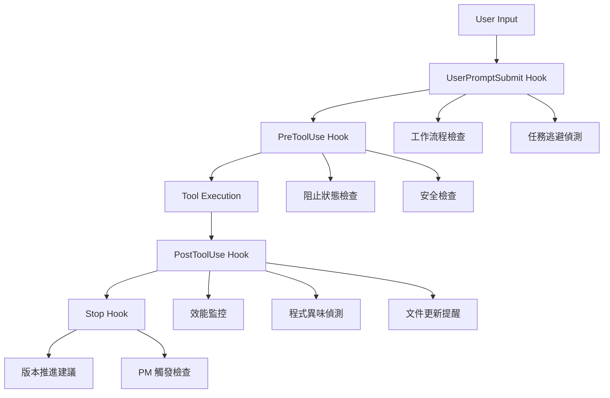

# 🔧 Hook 系統快速參考

## 📋 Hook 執行流程



## 🎯 三大鐵律自動執行

| 鐵律 | Hook 實現 | 觸發條件 | 執行方式 |
|------|-----------|----------|----------|
| **測試通過率鐵律** | UserPromptSubmit + PreToolUse | ESLint 錯誤檢測 | 記錄追蹤 + 強制修復提醒 |
| **永不放棄鐵律** | Task Avoidance Detection | 禁用詞彙/逃避行為 | **完全阻止操作** |
| **架構債務零容忍鐵律** | Code Smell Detection + PostEdit | 程式異味偵測 | 自動 Agent 處理 |

## 🚨 關鍵 Hook 說明

### Task Avoidance Detection Hook
**最高優先級 - 強制阻止機制**

#### 禁用詞彙清單
```text
"太複雜", "暫時", "跳過", "之後再改", "先將就"
"暫時性修正", "症狀緩解", "時間不夠", "複雜度太高"
"不在這次範圍", "留待後續處理", "workaround"
```

#### 觸發阻止的條件
- 工作記錄中包含任何禁用詞彙
- 跳過的測試 (`skip`, `pending`, `xdescribe`, `xit`)
- 過多的 ESLint 忽略 (>5 處)
- 技術債務過度累積 (>15 個 TODO/FIXME)
- 程式碼變更但沒有測試更新

#### 解除阻止流程
1. 檢查報告: `cat .claude/hook-logs/avoidance-reports/[latest].md`
2. 修正所有逃避行為
3. 移除禁用詞彙，重新描述解決方案
4. 修復所有跳過的測試
5. 處理所有技術債務
6. 執行: `rm .claude/TASK_AVOIDANCE_BLOCK`

### Architecture Debt Detection Hook 🆕
**架構債務偵測 - 強制正確修正順序**

- **觸發時機**: PostEdit - 程式碼變更後
- **功能**:
  - 偵測重複服務實作（如多個 GoogleBooksApiService）
  - 檢查架構原則違規（Domain 層依賴具體實作）
  - 驗證測試架構一致性（重複 Mock、使用真實服務）
  - 生成正確的重構順序指南
- **核心原則**: **文件 → 測試 → 實作 → 介面**
- **阻擋機制**: 發現架構問題時阻止繼續執行，強制先修正文件和測試
- **輸出檔案**:
  - `.claude/hook-logs/architecture-issues.md` - 詳細問題報告
  - `.claude/ARCHITECTURE_REVIEW_REQUIRED` - 審查標記

### Task Documentation Validation Hook 🆕
**任務規劃自動檢查 - 方法論合規性**

- **觸發時機**: PostEdit - 工作日誌檔案修改後
- **目標檔案**: `docs/work-logs/v*.*.*.md`
- **執行順序**: order 30 (在 Code Smell Detection Hook 之後)

#### 檢查項目

**強制章節** (必須存在):
- 📋 參考文件
- 📁 影響範圍

**參考文件子章節** (必須完整):
- UseCase 參考
- 流程圖參考（具體到 Event）
- 架構規範
- 依賴類別
- 測試設計參考

**影響範圍子章節** (必須完整):
- 需要建立的檔案
- 需要修改的檔案
- 預估影響的測試檔案
- 影響的依賴關係

#### 檢查等級

1. **✅ 完全符合**: 所有強制章節和子章節都存在
2. **⚠️ 部分缺失**: 強制章節存在，但子章節不完整
3. **❌ 嚴重缺失**: 缺少強制章節，任務規劃不合格

#### 輸出檔案

- 檢查報告: `.claude/hook-logs/task-doc-validation/validation-YYYYMMDD-HHMMSS.md`
- 包含詳細缺失項目和補充建議模板
- 缺失時提供完整的參考文件和影響範圍模板

#### 使用範例

查看最新檢查報告:
```bash
ls -lt .claude/hook-logs/task-doc-validation/ | head -2
```

手動執行檢查:
```bash
.claude/hooks/post-edit-task-doc-validation.sh docs/work-logs/v0.12.1-domain-interfaces.md
```

### Code Smell Detection Hook
**智能品質控制 - Agent 整合**

#### 偵測的程式異味
- **長函數** (>30行)
- **深層巢狀** (>4層)
- **大型類別** (>200行)
- **過長參數列表** (>5個)
- **程式碼重複** (>5處)
- **魔術數字** (>3處)
- **高耦合** (>10個依賴)

#### Agent 自動處理流程
1. 偵測異味 → 生成結構化報告
2. 啟動背景 Agent → 更新 TodoList
3. 按嚴重程度分類 (High/Medium/Low)
4. 不中斷開發流程

### Performance Monitor Hook
**系統效能監控**

#### 效能閾值
- ✅ 理想: < 1秒
- ⚠️ 警告: 2-5秒
- ❌ 錯誤: > 5秒

#### 監控指標
- Hook 執行時間
- 記憶體使用量
- 執行頻率統計
- 效能趨勢分析

### PM Trigger Hook
**智能專案管理介入機制**

#### 觸發條件
- **TDD 階段轉換**: Phase 1-4 完成標記檢測
- **進度停滯**: 工作日誌超過 2 天未更新
- **複雜度超標**: 技術債務 >15 個或 ESLint 錯誤 >50 個
- **Agent 升級請求**: 工作日誌中包含升級關鍵字
- **里程碑接近**: 版本號接近重要節點 (0.9.x → 1.0.0)

#### 觸發動作
- 生成 PM 狀態檔案 `.claude/pm-status.json`
- 建立介入提醒 `.claude/PM_INTERVENTION_REQUIRED`
- 記錄觸發原因和當前上下文
- 提供具體的 PM 行動建議

#### PM 狀態檢查工具
使用 `./scripts/pm-status-check.sh` 查看：
- 觸發狀態和原因
- 當前工作進度
- TodoList 優先級分析
- 技術債務狀況
- 版本推進建議

## 📁 Hook 檔案位置

```text
scripts/
├── startup-check-hook.sh              # SessionStart
├── prompt-submit-hook.sh               # UserPromptSubmit
├── task-avoidance-detection-hook.sh    # UserPromptSubmit (逃避偵測)
├── task-avoidance-block-check.sh       # PreToolUse (阻止檢查)
├── pre-commit-hook.sh                  # PreToolUse (Git)
├── pre-test-hook.sh                    # PreToolUse (測試)
├── post-edit-hook.sh                   # PostToolUse (編輯)
├── post-test-hook.sh                   # PostToolUse (測試)
├── code-smell-detection-hook.sh        # PostToolUse (異味偵測)
├── post-edit-task-doc-validation.sh    # PostToolUse (任務規劃檢查) 🆕
├── architecture-debt-detection-hook.sh # PostToolUse (架構債務檢測)
├── auto-documentation-update-hook.sh   # PostToolUse (文件提醒)
├── performance-monitor-hook.sh         # 通用效能監控
├── stop-hook.sh                        # Stop
├── pm-trigger-hook.sh                  # Stop (PM 觸發檢查)
└── pm-status-check.sh                  # PM 狀態檢查工具
```

## 🔧 設定檔案

**`.claude/settings.local.json`** - Hook 配置
- SessionStart: 環境檢查
- UserPromptSubmit: 合規性檢查 + 逃避偵測
- PreToolUse: 阻止檢查 + 安全檢查
- PostToolUse: 品質檢查 + 異味偵測 + 文件提醒
- Stop: 版本推進建議

## 📊 日誌和報告

### 日誌位置
```text
.claude/hook-logs/
├── startup-[timestamp].log
├── prompt-submit-[timestamp].log
├── post-edit-[timestamp].log
├── code-smell-[timestamp].log
├── task-doc-validation/           # 任務文件檢查報告 🆕
│   └── validation-[timestamp].md
├── performance/
│   ├── perf-monitor-[date].log
│   └── metrics.csv
├── smell-reports/
├── avoidance-reports/
└── issues-to-track.md
```

### 重要檔案
- **`.claude/TASK_AVOIDANCE_BLOCK`** - 阻止狀態標記
- **`.claude/pm-status.json`** - PM 觸發狀態記錄
- **`.claude/PM_INTERVENTION_REQUIRED`** - PM 介入提醒標記
- **`issues-to-track.md`** - 問題追蹤提醒
- **`metrics.csv`** - 效能監控資料

## ⚡ 緊急操作

### 解除所有阻止
```bash
# 僅在緊急情況下使用
rm -f .claude/TASK_AVOIDANCE_BLOCK
```

### 檢查當前狀態
```bash
# 檢查是否有阻止狀態
ls -la .claude/TASK_AVOIDANCE_BLOCK

# 檢查 PM 觸發狀態
./scripts/pm-status-check.sh

# 查看最新問題
cat .claude/hook-logs/issues-to-track.md

# 檢查最新異味報告
ls -t .claude/hook-logs/smell-reports/ | head -1
```

### 手動執行關鍵檢查
```bash
# 手動執行逃避偵測
./scripts/task-avoidance-detection-hook.sh

# 手動執行程式異味檢查
./scripts/code-smell-detection-hook.sh

# 手動執行效能分析
./scripts/performance-monitor-hook.sh

# 手動執行 PM 觸發檢查
./scripts/pm-trigger-hook.sh
```

## 🎯 最佳實踐

### 開發者指引
1. **理解阻止機制** - 不要嘗試繞過，專注於修正問題
2. **接受品質標準** - Hook 系統是為了確保程式碼品質
3. **學習改善** - 查看報告了解改善方向
4. **主動預防** - 開發時就避免產生異味

### 專案管理指引
1. **監控趨勢** - 定期檢查效能和品質趨勢
2. **調整閾值** - 根據專案特性調整檢查標準
3. **培訓團隊** - 確保團隊理解 Hook 系統運作
4. **持續改善** - 根據實際使用情況優化 Hook

這個 Hook 系統確保專案始終維持最高的品質標準，是專案成功的重要基礎設施。
