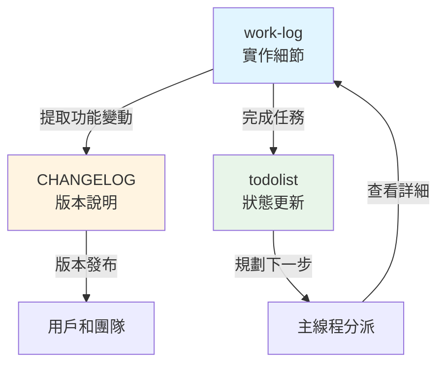
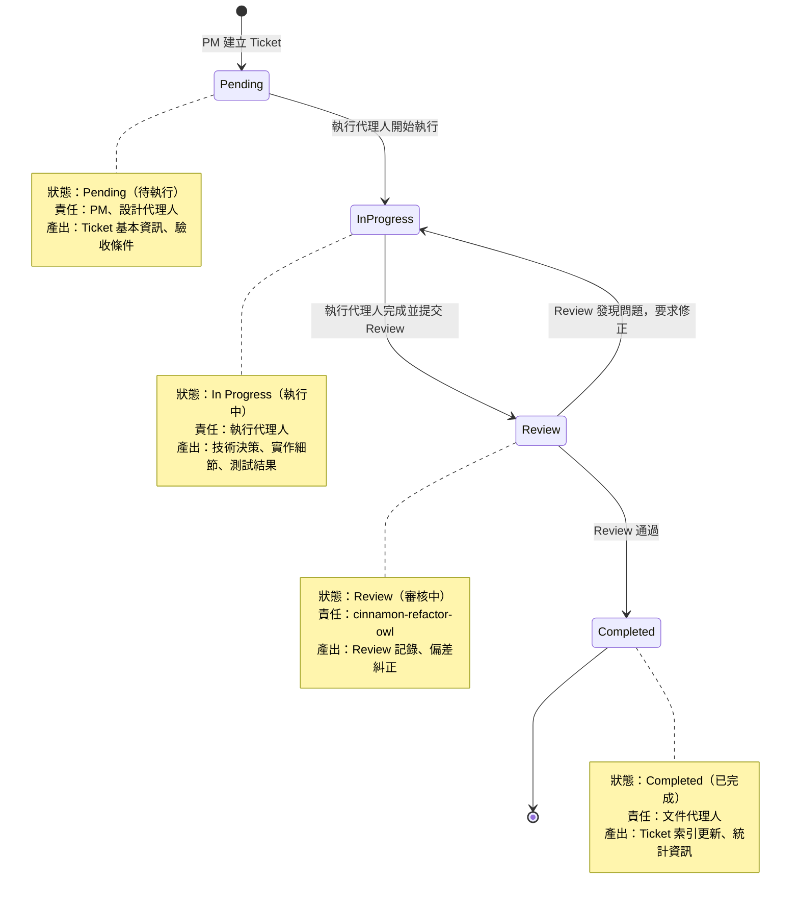
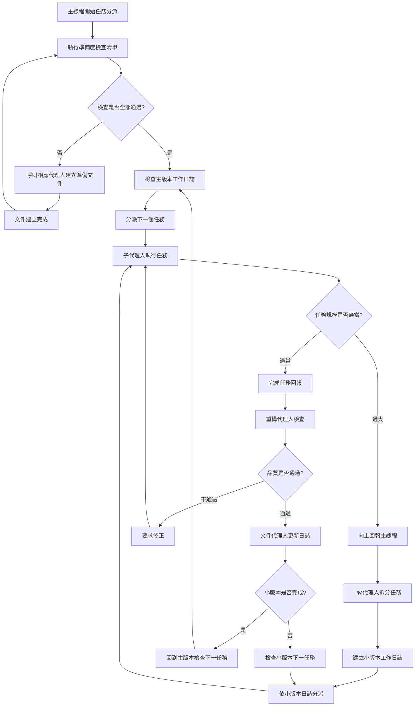
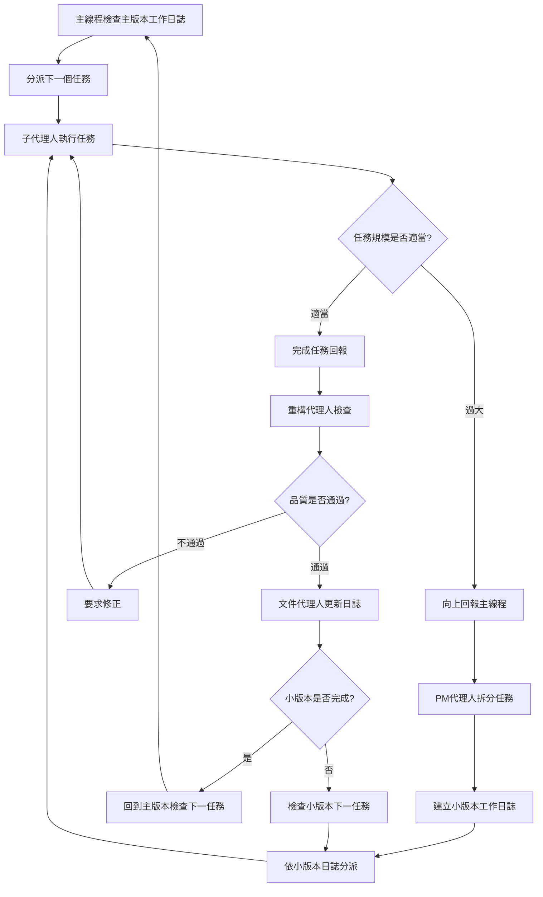
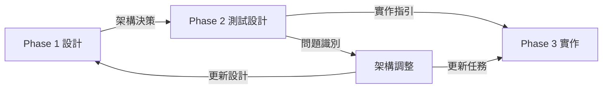
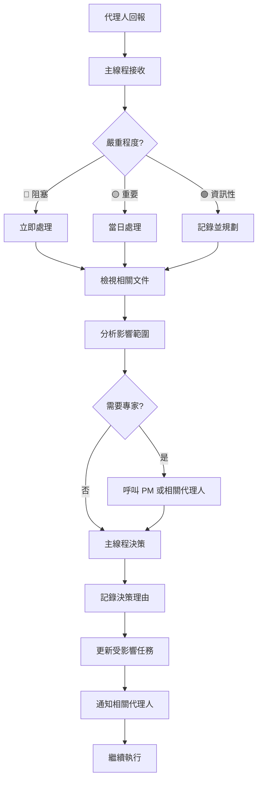
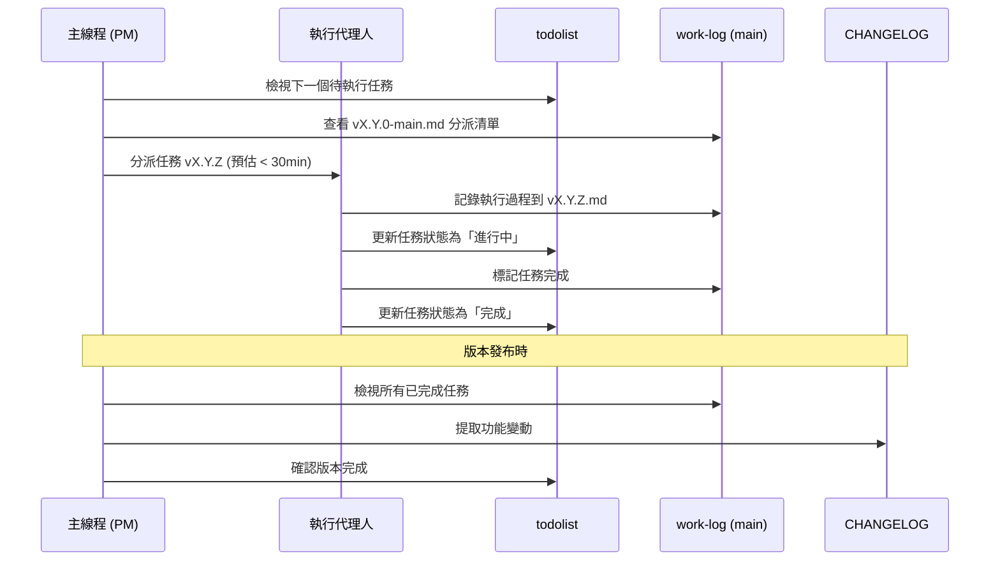
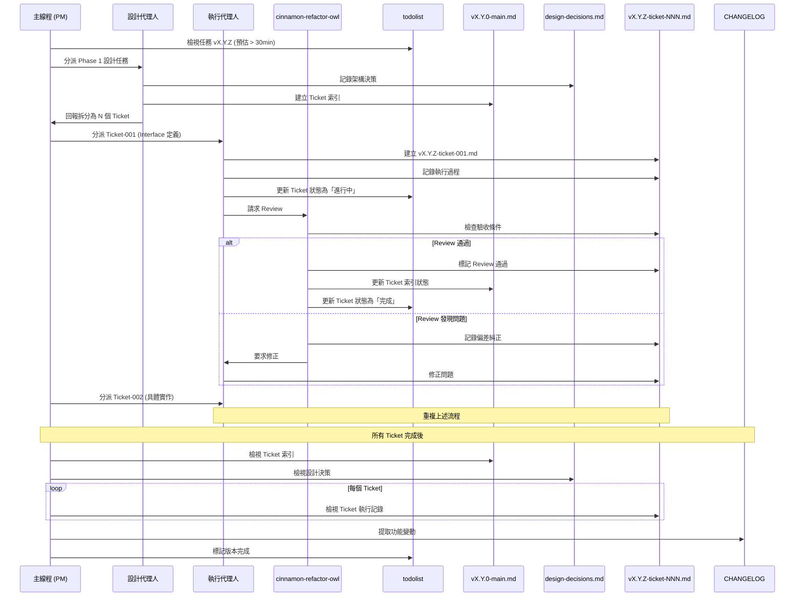
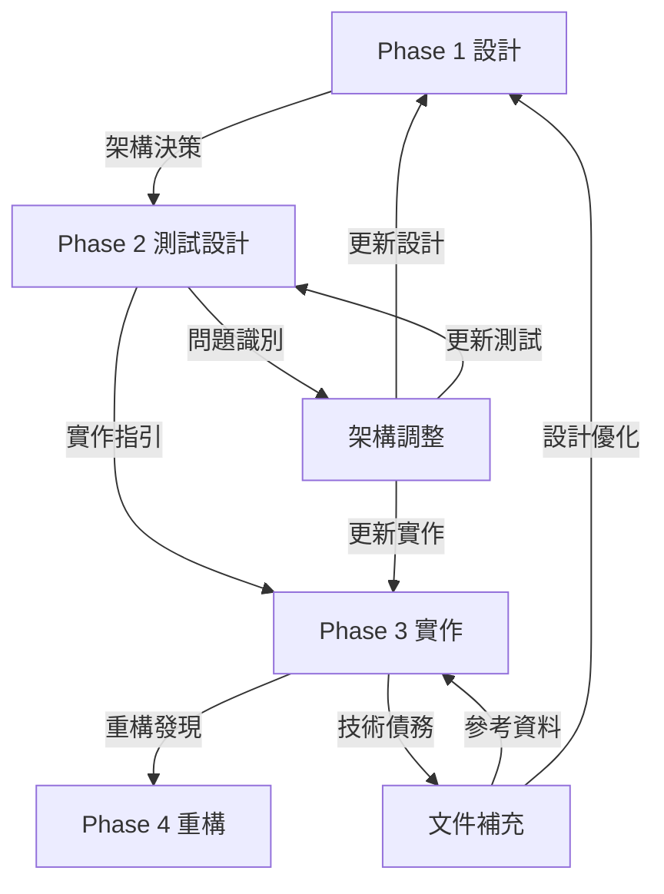
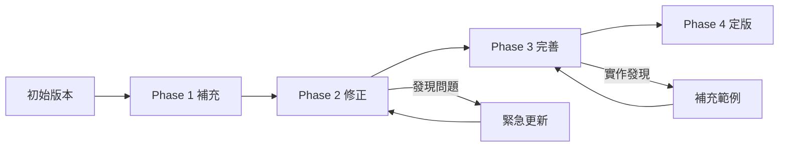

# 🚀 敏捷重構方法論 - Agent 分工協作模式

## 📖 方法論概述

本方法論定義了大規模程式碼重構的敏捷開發流程，採用主線程統籌分派、子代理人專責執行的協作模式，確保重構品質和進度控制。

## 🎯 核心原則

### 1. 主線程職責專一化
- **只負責任務分派和統籌管理**，絕不親自執行具體重構工作
- 依照工作日誌規劃分派任務給相應的子代理人
- 維持敏捷開發的節奏和品質標準

### 2. 任務原子化拆分（整合 Ticket 機制）

**原有原則**：
- 每個小版本任務必須在 1-2 小時內完成
- 任務影響檔案數量控制在 5 個以下
- 每個任務都有明確的完成標準和驗收條件

**Ticket 量化拆分標準**（新增）：

小版本任務可進一步拆分為 Ticket，每個 Ticket 必須符合以下量化標準：

| 維度 | Simple Ticket | Medium Ticket | Complex Ticket |
|------|--------------|---------------|----------------|
| **完成時間** | 5-10 分鐘 | 10-20 分鐘 | 20-30 分鐘 |
| **程式碼行數** | < 30 行 | 30-70 行 | 70-100 行 |
| **影響檔案** | 1-2 個 | 2-3 個 | 3-5 個 |
| **測試案例** | 1-3 個 | 3-6 個 | 6-10 個 |

**強制規則**：
- ⚠️ **超過 30 分鐘 = 必須拆分**
- ⚠️ **超過 100 行程式碼 = 必須拆分**
- ⚠️ **超過 5 個檔案 = 必須拆分**
- ⚠️ **超過 10 個測試案例 = 必須拆分**

**基於 Clean Architecture 的拆分策略**（新增）：

根據 Clean Architecture 分層原則，任務可拆分為以下 Ticket 類型：

1. **Interface 定義 Ticket**
   - 定義內層介面（Ports）
   - 時間：5-10 分鐘（Simple）
   - 產出：介面簽名、輸入輸出定義、註解文檔
   - 範例：定義 IBookRepository 介面

2. **具體實作 Ticket**
   - 實作具體類別（Interactors）
   - 時間：10-20 分鐘（Medium）
   - 產出：業務邏輯實作、錯誤處理
   - 範例：實作 BookQueryService 類別

3. **測試驗證 Ticket**
   - 撰寫單元測試
   - 時間：10-20 分鐘（Medium）
   - 產出：測試案例和驗證、Mock 設置
   - 範例：撰寫 BookQueryService 測試

4. **整合連接 Ticket**
   - 依賴注入和組裝
   - 時間：5-10 分鐘（Simple）
   - 產出：組裝程式碼、依賴注入配置
   - 範例：在 Composition Root 連接 Repository

**Ticket 複雜度評估方法**：

評估 4 個維度，每個維度 1-10 分：
- **技術複雜度**：使用新技術、複雜演算法、效能優化
- **業務複雜度**：複雜業務規則、多條件判斷、狀態管理
- **整合複雜度**：多模組整合、外部 API、資料庫操作
- **測試複雜度**：需要 Mock 的依賴數量、測試案例覆蓋範圍

**複雜度公式**：
```text
Ticket 複雜度 = (技術 + 業務 + 整合 + 測試) / 4

Simple:   < 3 分
Medium:   3-6 分
Complex:  > 6 分
```

**參考文件**：
- [Ticket 設計派工方法論 - 第 2 章]($CLAUDE_PROJECT_DIR/.claude/methodologies/ticket-design-dispatch-methodology.md)
- [Clean Architecture 實作方法論 - 第 3 章]($CLAUDE_PROJECT_DIR/.claude/methodologies/clean-architecture-implementation-methodology.md)

### 3. 品質門檻強制執行
- 每個任務完成後必須通過測試檢查
- 重構代理人強制驗證程式碼品質
- 100% 測試通過率是最低要求

## 🤖 Agent 角色定義

### 主線程 (Main Thread)
**職責**：
- 📋 依照主版本工作日誌分派任務
- 🎯 維持敏捷開發節奏
- 📊 監控整體進度和品質
- 🚨 處理升級請求和任務重新分派

**禁止行為**：
- ❌ 親自閱讀或修改程式碼
- ❌ 執行具體的重構工作
- ❌ 繞過子代理人直接操作

### 子代理人 (Sub-Agents)
**職責**：
- 🔧 執行指派的具體重構任務
- 📝 回報任務完成狀態和結果
- 🚨 發現任務規模過大時向上回報
- ✅ 確保任務符合完成標準

**專業分工**：
- **lavender-interface-designer**: TDD Phase 1 功能設計
- **sage-test-architect**: TDD Phase 2 測試設計
- **pepper-test-implementer**: TDD Phase 3a 語言無關策略規劃
- **parsley-flutter-developer**: TDD Phase 3b Flutter 特定實作
- **cinnamon-refactor-owl**: TDD Phase 4 重構執行
- **mint-format-specialist**: 程式碼格式化和品質修正

**Note**: Phase 3 分為兩階段：
- **Phase 3a (pepper)**: 語言無關的實作策略規劃（虛擬碼、流程圖、架構決策）
- **Phase 3b (parsley)**: Flutter 特定的程式碼實作

### 重構代理人 (Refactor Validator)
**職責**：
- 🔍 檢查子代理人完成的重構工作
- ✅ 驗證程式碼品質和功能正確性
- 📊 確認測試通過率和效能標準
- 🎯 批准任務完成或要求修正

**代理人**: `cinnamon-refactor-owl`

### PM 代理人 (Project Manager)
**職責**：
- 📋 任務規模過大時進行二次拆分
- 📝 更新小版本工作日誌
- 🎯 重新規劃任務執行順序
- 📊 管理任務依賴關係

**代理人**: `rosemary-project-manager`

### 文件代理人 (Documentation Agent)
**職責**：
- 📝 更新小版本工作日誌
- ✅ 標記小版本完成狀態
- 📊 記錄任務執行結果
- 🔄 同步文件狀態

**代理人**: `memory-network-builder`

### Agent 與 Clean Architecture 分層對應

**Phase 1 (lavender-interface-designer)**：
- **設計內層介面**：Entities、Use Cases Interface
- **依賴方向設計**：確保內層不依賴外層
- **Interface 定義 Ticket**：定義內層 Ports

**Phase 3a (pepper-test-implementer)**：
- **規劃 Interface-Driven Development 策略**
- **設計依賴注入流程**
- **規劃 Outer → Inner 實作順序**

**Phase 3b (parsley-flutter-developer)**：
- **實作 Outer → Inner**：從 Frameworks 到 Entities
- **具體實作 Ticket**：實作 Interactors 和 Adapters
- **整合連接 Ticket**：依賴注入和組裝

**Phase 4 (cinnamon-refactor-owl)**：
- **架構合規性檢查**：檢查分層和依賴方向
- **重構優化**：改善架構品質
- **Ticket Review**：檢查 Ticket 品質

### Agent 與 Ticket 機制對應

**rosemary-project-manager (PM)**：
- **Ticket 拆分**：將小版本任務拆分為 Ticket
- **依賴關係管理**：梳理 Ticket 間依賴
- **Ticket 索引維護**：維護主版本日誌的 Ticket 索引

**執行代理人（lavender, pepper, parsley 等）**：
- **執行單一 Ticket**：專注執行指派的 Ticket
- **記錄 Ticket 日誌**：撰寫 Ticket 工作日誌
- **回報 Ticket 完成**：回報 Ticket 執行結果

**cinnamon-refactor-owl (Reviewer)**：
- **Ticket Review**：每個 Ticket 完成後立即 Review
- **偏差糾正**：發現問題要求修正
- **品質驗證**：確保 Ticket 符合驗收條件

**memory-network-builder (文件代理人)**：
- **Ticket 完成後文檔更新**：更新 todolist 狀態
- **設計決策記錄**：維護設計決策日誌
- **版本總結**：小版本完成時更新 CHANGELOG

## 🚨 任務分派前強制檢查清單

**重要**: 在分派任何重構任務前，主線程必須先通過以下檢查清單。如果無法回答這些問題，必須優先建立準備文件。

### 📋 準備度檢查問題

#### 1. 明確的文件規劃
- [ ] **API 規格是否完整？** 代理人知道要實作什麼樣的介面和行為嗎？
- [ ] **設計文件是否具體？** 有詳細的類別定義、方法簽名、使用範例嗎？
- [ ] **架構圖是否清晰？** 代理人知道新系統的整體架構和元件關係嗎？

#### 2. 測試先行策略
- [ ] **測試規格是否存在？** 每個元件都有對應的測試規格和驗收標準嗎？
- [ ] **TDD 流程是否明確？** 代理人知道要先寫什麼測試再實作嗎？
- [ ] **效能標準是否定義？** 有明確的效能基準和測試方法嗎？

#### 3. 實作目標明確性
- [ ] **完成標準是否可測量？** 代理人知道什麼程度才算任務完成嗎？
- [ ] **使用範例是否充足？** 有具體的程式碼範例展示最終產品嗎？
- [ ] **移轉策略是否清楚？** 有舊系統到新系統的具體移轉指引嗎？

#### 4. 風險評估與應對
- [ ] **潛在問題是否識別？** 有預見可能的技術難點和解決方案嗎？
- [ ] **回滾計畫是否準備？** 出問題時有明確的回滾和修復策略嗎？
- [ ] **依賴關係是否梳理？** 知道任務間的依賴順序和影響範圍嗎？

#### 5. 參考文件和影響範圍完整性（強制）⚠️
- [ ] **UseCase 參考是否明確？** 工作日誌是否列出對應的 UseCase 和業務需求？
- [ ] **流程圖 Event 是否具體？** 是否指定要實作流程圖的哪些 Event 編號和對應類別/方法？
- [ ] **架構規範是否引用？** 是否明確列出適用的架構規範文件（Clean Architecture、DDD、錯誤處理等）？
- [ ] **依賴類別是否列舉？** 是否列出前置任務產出的依賴類別和版本號？
- [ ] **測試設計是否參考？** 是否明確測試檔案、測試數量和效能基準？
- [ ] **影響檔案是否清單化？** 是否完整列出需建立、修改、影響的檔案清單？
- [ ] **影響範圍是否評估？** 是否評估對上層模組和下層模組的影響？

**違規處理**: 缺少任何一項參考文件或影響範圍資訊，視為**任務規劃不合格**，必須立即補充後才能分派給代理人執行。

#### 6. 設計面效能考量（前後端通用）⚠️
- [ ] **效能瓶頸是否識別？** 是否分析潛在的效能瓶頸（大量資料處理、複雜運算、API 等待、資料庫查詢）？
- [ ] **優化策略是否規劃？** 是否規劃對應的優化策略（異步處理、Isolate、快取機制、分頁載入、索引優化）？
- [ ] **資源使用是否評估？** 是否評估記憶體使用、網路請求數量、CPU 負載、儲存空間需求？
- [ ] **UI 阻塞是否避免？** (前端) 是否確保 UI 主執行緒不被阻塞（異步操作、Loading State、compute/Isolate）？
- [ ] **回應時間是否設計？** (後端) 是否設計 API 回應時間目標和逾時處理機制？
- [ ] **效能基準是否設定？** 是否定義具體的效能目標和測量方式（載入時間、渲染幀率、API 回應時間）？

**適用範圍**:
- ✅ Flutter/Dart 前端開發（UI 渲染、資料處理、狀態管理）
- ✅ Backend API 開發（查詢優化、快取策略、並發處理）
- ✅ 資料處理邏輯（JSON 解析、大量計算、批次處理）
- ✅ 所有可能影響使用者體驗的功能

**強制要求**:
- Phase 1 設計規格必須包含「效能考量」章節
- 所有任務分派都需要評估效能影響
- 無論前後端開發，都要從設計面預防效能問題
- 效能問題在設計階段解決，而非依賴測試發現

**參考文件**:
- [TDD 協作流程 - Phase 4-1 UI 效能檢查]($CLAUDE_PROJECT_DIR/.claude/tdd-collaboration-flow.md)
- [測試金字塔設計 - 效能測試策略]($CLAUDE_PROJECT_DIR/docs/test-pyramid-design.md)
- [Widget 測試指導原則 - 禁止效能測試]($CLAUDE_PROJECT_DIR/test/TESTING_GUIDELINES.md)

**違規處理**: 缺少效能考量分析，視為**設計規劃不完整**，必須補充效能分析後才能分派任務。

#### 7. Clean Architecture 合規性檢查

- [ ] **分層設計是否明確？** 是否明確區分 Entities、Use Cases、Interface Adapters、Frameworks 層級？
  - 參考：[Clean Architecture 實作方法論 - 第 1 章]($CLAUDE_PROJECT_DIR/.claude/methodologies/clean-architecture-implementation-methodology.md)

- [ ] **依賴方向是否正確？** 是否確保內層不依賴外層（依賴反轉原則）？
  - 檢查：Use Cases 是否依賴 Entities？
  - 檢查：Infrastructure 是否依賴 Domain 介面？

- [ ] **介面定義是否優先？** 是否採用 Interface-Driven Development 策略？
  - 檢查：內層介面（Ports）是否先定義？
  - 檢查：外層是否依賴內層介面而非具體實作？

- [ ] **依賴注入是否規劃？** 是否規劃組裝階段的依賴注入方式？
  - 檢查：Composition Root 設計是否明確？
  - 檢查：依賴注入流程是否清楚？

**違規處理**: 缺少 Clean Architecture 設計規劃，視為**架構設計不完整**，必須補充架構設計後才能分派任務。

**參考文件**:
- [Clean Architecture 實作方法論]($CLAUDE_PROJECT_DIR/.claude/methodologies/clean-architecture-implementation-methodology.md)
- [事件驅動架構規範]($CLAUDE_PROJECT_DIR/.claude/event-driven-architecture.md)

#### 8. Ticket 設計準備度檢查

- [ ] **Ticket 拆分是否量化？** 是否符合 5-30 分鐘、< 100 行、≤ 5 檔案、≤ 10 測試的標準？
  - 檢查：每個 Ticket 預估時間是否在範圍內？
  - 檢查：Ticket 複雜度是否已評估？

- [ ] **Ticket 驗收是否明確？** 每個 Ticket 是否有 SMART 驗收條件？
  - Specific: 驗收條件具體明確
  - Measurable: 驗收條件可測量
  - Achievable: 驗收條件可達成
  - Relevant: 驗收條件相關性
  - Time-bound: 驗收條件有時限

- [ ] **Ticket 依賴是否梳理？** Ticket 間的依賴關係是否清楚標註？
  - 檢查：前置 Ticket 是否標註？
  - 檢查：可並行 Ticket 是否識別？

- [ ] **Review 時機是否規劃？** 是否規劃每個 Ticket 完成後的 Review 流程？
  - 檢查：Review 檢查項目是否定義？
  - 檢查：偏差糾正流程是否規劃？

**違規處理**: Ticket 拆分不符合量化標準，視為**任務規劃不合格**，必須重新拆分後才能分派給代理人執行。

**參考文件**:
- [Ticket 設計派工方法論]($CLAUDE_PROJECT_DIR/.claude/methodologies/ticket-design-dispatch-methodology.md)
- [Ticket 拆分標準 - 第 2 章]($CLAUDE_PROJECT_DIR/.claude/methodologies/ticket-design-dispatch-methodology.md#第二章ticket-拆分標準)

### 🚨 準備度檢查失敗處理

**如果任何檢查項目回答為「否」，必須執行以下優先動作**：

#### 優先動作1: 建立 API 規格文件
```markdown
檔案: docs/[feature-name]-api-specification.md
內容:
- 完整的介面定義
- 詳細的方法簽名
- 具體的使用範例
- 效能要求規格
```

#### 優先動作2: 建立 TDD 測試規格
```markdown
檔案: docs/[feature-name]-test-specification.md
內容:
- 每個元件的測試案例
- 驗收測試標準
- 效能基準測試
- 整合測試場景
```

#### 優先動作3: 建立移轉指引
```markdown
檔案: docs/[feature-name]-migration-guide.md
內容:
- 舊系統→新系統對照表
- 常見使用場景範例
- 最佳實踐指引
- 問題排除手冊
```

#### 優先動作4: 建立實作範例
```markdown
檔案: docs/[feature-name]-implementation-examples.md
內容:
- 完整的程式碼範例
- 使用情境示範
- 常見模式展示
- 最佳實踐指引
```

### 📝 準備文件建立流程

#### 文件建立責任分工
- **API 規格**: lavender-interface-designer (功能設計專家)
- **測試規格**: sage-test-architect (測試設計專家)
- **移轉指引**: memory-network-builder (文件專家)
- **實作範例**: pepper-test-implementer (實作規劃專家)

#### 文件品質標準
- **完整性**: 涵蓋所有必要資訊，無遺漏
- **具體性**: 提供可執行的詳細指引，非概念性描述
- **一致性**: 與整體架構和設計原則保持一致
- **可測試性**: 所有規格都可以通過測試驗證

## 📋 三重文件原則 (Triple Document Principle)

本方法論採用三重文件機制確保不同層級的資訊流動和代理人協調。

### 文件層級定義

#### 1️⃣ CHANGELOG.md - 版本功能變動記錄

**職責**：
- 面向用戶的版本功能描述
- 只記錄「做了什麼」，不記錄「怎麼做」
- 版本發布時的正式變更說明
- 符合 Keep a Changelog 規範

**格式範例**：
```markdown
## v0.11.0 (2025-09-30)

### 新增功能
- 統一書籍資訊查詢服務
- 支援 Google Books API 整合

### 改善
- 優化錯誤處理機制
- 提升查詢效能

### 修復
- 修正 ISBN 驗證問題
```

**更新時機**：
- 版本發布時由文件代理人更新
- 從 work-log 提取用戶可感知的功能變動
- 不記錄內部重構或技術細節

#### 2️⃣ todolist.md - 開發任務全景圖

**職責**：
- 記錄整個開發過程所有待處理任務
- 任務狀態追蹤（待執行/進行中/已完成）
- 優先級排序和依賴關係管理
- 跨版本的任務規劃視圖

**代理人使用場景**：
- **PM 代理人**：規劃任務優先序和依賴關係
- **主線程**：查看全局並分派下一個任務
- **執行代理人**：了解任務背景和依賴
- **所有代理人**：查看整體進度和下一步方向

**內容結構**：
```markdown
# TodoList

## v0.11.x 系列任務
- [x] v0.11.0 統一書籍資訊查詢服務
  - [x] Phase 1: 流程設計
  - [x] Phase 2: 測試設計
  - [ ] Phase 3: 實作執行
    - [x] v0.11.3 Domain 輸入驗證
    - [x] v0.11.4 核心查詢服務
    - [ ] v0.11.5 資料處理和快取
- [ ] v0.11.15 測試修復完成

## v0.12.x 系列任務（規劃中）
- [ ] v0.12.0 外部 API 整合
```

**更新責任**：
- 所有代理人在任務狀態變更時即時更新
- PM 代理人負責新增和重組任務
- 主線程負責維護任務優先序

#### 3️⃣ work-log/ - 詳細實作記錄

**職責**：
- 完整的技術實作細節和決策過程
- TDD 四階段進度追蹤
- 代理人交接的完整上下文
- 問題發現和解決方案記錄

**文件結構**：
- **主版本日誌** (`vX.Y.0-main.md`)：中版本總覽、任務分派清單、Ticket 索引
- **小版本日誌** (`vX.Y.Z-task.md`)：具體任務的詳細執行記錄
- **Ticket 日誌** (`vX.Y.Z-ticket-NNN.md`)：單一 Ticket 的執行記錄

**標準模板參考**：

本專案提供標準化工作日誌模板，基於《清單革命》原則設計：

- **主版本工作日誌模板**：`.claude/templates/work-log-template.md`
  - 適用於：包含多個 Ticket 的主版本任務
  - 核心欄位：任務概述、TDD 階段狀態、驗收條件、協作檢查點、驗收暫停點

- **Ticket 工作日誌模板**：`.claude/templates/ticket-log-template.md`
  - 適用於：單一 Ticket 任務
  - 核心欄位：Ticket 資訊（5 個核心欄位）、TDD 階段狀態、協作檢查點

**內容標準**：

工作日誌必須包含以下核心欄位（詳見模板）：

```markdown
# vX.Y.Z 任務名稱

## 任務概述
- 任務編號、建立日期、狀態、完成日期
- 任務目標、背景說明

## 🎯 當前階段狀態
| TDD 階段 | 狀態 | 完成時間 | 備註 |
- Phase 1-4 獨立標記
- 總體狀態判定規則

## ✅ 驗收條件（SMART 原則）
- Phase 1-4 各階段驗收
- 提交前驗收

## 🤝 協作檢查點
- Phase 交接溝通確認
- 代理人交接資訊完整性

## ⏸️ 驗收暫停點
- 5 個關鍵暫停點定義
- 檢查人和通過標準

## 📋 清單使用模式
- DO-CONFIRM 或 READ-DO 模式

## 📋 執行記錄
- Phase 1-4 詳細執行記錄
- 產出檔案、Review 記錄
```

**工作日誌填寫時機**：

| TDD Phase | 填寫時機 | 執行代理人 | 關鍵記錄內容 |
|-----------|---------|-----------|------------|
| **Phase 1** | 設計完成時 | lavender-interface-designer | 設計文件、介面定義、架構決策 |
| **Phase 2** | 測試設計完成時 | sage-test-architect | 測試案例、覆蓋範圍、測試策略 |
| **Phase 3a** | 策略規劃完成時 | pepper-test-implementer | 虛擬碼、流程圖、實作指引 |
| **Phase 3b** | 程式實作完成時 | parsley-flutter-developer | 實作邏輯、測試結果、問題解決 |
| **Phase 4** | 重構完成時 | cinnamon-refactor-owl | 重構評估、執行記錄、品質改善 |

**Phase 3 完成時的工作日誌填寫（重點說明）**：

Phase 3 是 TDD 流程中最關鍵的階段，必須確保工作日誌完整記錄：

1. **pepper-test-implementer (Phase 3a)**：
   - ✅ 記錄實作策略和虛擬碼到「Phase 3a 執行記錄」區塊
   - ✅ 更新 TDD 階段狀態表：Phase 3a 標記為「完成」
   - ✅ 填寫 Phase 交接溝通確認清單
   - ✅ 確保 parsley 可從記錄理解實作策略

2. **parsley-flutter-developer (Phase 3b)**：
   - ✅ 記錄程式碼實作邏輯到「Phase 3b 執行記錄」區塊
   - ✅ 記錄測試執行結果（通過率、dart analyze 結果）
   - ✅ 記錄遇到的問題和解決方案
   - ✅ 更新 TDD 階段狀態表：Phase 3b 標記為「完成」
   - ✅ 填寫 Phase 3 驗收條件打勾
   - ✅ 執行 Phase 3 暫停點檢查

**工作日誌自我檢查清單（所有代理人適用）**：

每個 Phase 完成後，執行代理人必須自我檢查以下項目：

- [ ] **執行記錄完整**：記錄了執行時間、執行人、關鍵產出
- [ ] **問題已記錄**：遇到的問題和解決方案已記錄
- [ ] **產出可交接**：下一階段代理人可從記錄理解產出內容
- [ ] **狀態已更新**：TDD 階段狀態表已更新為「完成」
- [ ] **驗收條件打勾**：該 Phase 的驗收條件已逐項檢查並打勾
- [ ] **協作清單完成**：Phase 交接溝通確認清單已填寫
- [ ] **暫停點檢查**：已執行該 Phase 的暫停點檢查並通過

**更新責任**：
- 執行代理人負責記錄詳細過程和即時更新狀態
- 文件代理人負責標記完成狀態和維護文件一致性
- PM 代理人負責維護主版本日誌和 Ticket 索引管理

### 三重文件協調機制

#### 資訊流動方向



**流程說明**：
1. 代理人在 **work-log** 記錄詳細實作過程
2. 任務完成時更新 **todolist** 狀態
3. 版本發布時從 **work-log** 提取變動到 **CHANGELOG**
4. 主線程基於 **todolist** 和 **work-log** 規劃下一步

#### 代理人交接層級

##### 主線程 ↔ PM 代理人

**主要參考**：
- `todolist.md` - 任務全局和優先序
- `vX.Y.0-main.md` - 版本進度和任務拆分

**交接場景**：
- 任務規模過大需要拆分
- 規劃下一個版本系列
- 任務依賴關係調整

##### 主線程 ↔ 執行代理人

**主要參考**：
- `vX.Y.Z-task.md` - 具體任務詳細說明
- `todolist.md` - 任務依賴和背景

**交接場景**：
- 分派新任務
- 接收完成回報
- 處理問題升級

##### 執行代理人 ↔ 執行代理人

**主要參考**：
- `vX.Y.Z-task.md` - 前置任務的產出和發現
- `vX.Y.0-main.md` - 重要決策和架構調整

**交接場景**：
- Phase 1 → Phase 2：設計交接測試
- Phase 2 → Phase 3a：測試交接策略規劃
- Phase 3a → Phase 3b：策略交接實作（虛擬碼 → 實際程式碼）
- Phase 3b → Phase 4：實作交接重構
- 依賴任務間的產出交接

##### 版本發布時

**主要參考**：
- `work-log/` - 提取所有功能變動
- `todolist.md` - 確認完成項目

**執行流程**：
1. 文件代理人檢視所有已完成的 work-log
2. 提取用戶可感知的功能變動
3. 更新 CHANGELOG.md
4. 確認 todolist.md 狀態一致

### 三重文件更新責任

| 文件 | 更新時機 | 責任代理人 | 更新內容 | 更新頻率 |
|------|---------|-----------|---------|---------|
| **work-log** | 任務執行中/完成 | 執行代理人 | 詳細實作過程、決策記錄 | 即時 |
| **todolist** | 任務狀態變更 | 所有代理人 | 任務狀態、優先序 | 即時 |
| **CHANGELOG** | 版本發布 | 文件代理人 | 功能變動摘要 | 版本發布時 |

### 三重文件一致性檢查

#### 強制檢查項目

**版本號一致性**：
- CHANGELOG 版本號 = work-log 主版本號
- todolist 版本系列 = work-log 版本系列

**任務狀態一致性**：
- todolist 標記完成 ⇒ work-log 必須有對應完成記錄
- work-log 標記完成 ⇒ todolist 必須同步更新

**功能描述一致性**：
- CHANGELOG 功能描述 ⇒ 必須對應 work-log 實作內容
- 不可在 CHANGELOG 記錄未實作的功能

#### Hook 系統整合

**Version Check Hook**：
- 檢查三重文件版本號一致性
- 建議版本推進策略

**Document Sync Hook**：
- 提醒 work-log 完成時更新 todolist
- 提醒版本發布時更新 CHANGELOG

**Work Log Check Hook**：
- 識別工作狀態（更新/新建/完成）
- 確保 work-log 記錄完整性

### 強制要求

#### 文件完整性要求

1. **work-log 必須完整**：
   - 所有技術細節必須記錄
   - 所有決策必須說明理由
   - 所有問題發現必須記錄

2. **todolist 必須即時**：
   - 任務狀態即時更新，不得延遲
   - 新任務必須立即加入
   - 完成任務必須立即標記

3. **CHANGELOG 必須準確**：
   - 只記錄用戶可感知的變動
   - 不記錄內部重構或技術債務
   - 必須基於實際完成的 work-log

#### 代理人責任要求

1. **執行代理人**：
   - 任務執行過程必須記錄到 work-log
   - 任務完成時必須更新 todolist 狀態
   - 發現問題必須記錄到 work-log

2. **文件代理人**：
   - 版本發布時必須更新 CHANGELOG
   - 確保三重文件一致性
   - 標記 work-log 完成狀態

3. **PM 代理人**：
   - 維護 todolist 任務結構
   - 維護 vX.Y.0-main.md 任務分派
   - 確保任務依賴關係正確

4. **主線程**：
   - 不得親自修改程式碼
   - 基於 todolist 和 work-log 分派任務
   - 監控三重文件一致性

### v0.11.0 實戰範例

#### 三重文件協調實例

**work-log 記錄**（v0.11.3-domain-input-validation.md）：
```markdown
## Phase 3 實作完成
- BookQueryInput Value Object 實作
- InputValidator 驗證邏輯
- 71 個測試 100% 通過
```

**todolist 更新**：
```markdown
- [x] v0.11.3 Domain 輸入驗證
```

**CHANGELOG 提取**（版本發布時）：
```markdown
## v0.11.0 (2025-09-30)
### 新增功能
- 統一書籍資訊查詢服務（支援 ISBN、標題、作者查詢）
```

**協調流程**：
1. pepper-test-implementer 完成 v0.11.3 實作
2. 記錄詳細過程到 work-log
3. 更新 todolist 標記完成
4. 主線程分派下一個任務 v0.11.4
5. 版本發布時，文件代理人從所有 v0.11.x work-log 提取功能到 CHANGELOG

#### 代理人交接實例

**Phase 2 → Phase 3 交接**：

sage-test-architect 完成測試設計後：
```markdown
# v0.11.2-tdd-phase2-test-design.md

## Phase 2 產出
- 335 個測試用例設計
- 33 個測試檔案規劃
- 架構修正決策：BookEnrichmentData 遷移到 Domain 層

## 傳遞給 Phase 3
- 依賴類別：BookEnrichmentData (已遷移)
- 測試優先序：v0.11.3 → v0.11.4 → v0.11.5
- 重要發現：Domain 服務層需從零建立
```

pepper-test-implementer 接收後：
```markdown
# v0.11.3-domain-input-validation.md

## 參考文件
- 測試設計：v0.11.2-tdd-phase2-test-design.md#task-20
- 前置任務產出：無（首個任務）
- 架構調整：BookEnrichmentData 已遷移到 Domain 層

## Phase 3 執行
基於 Phase 2 測試設計，實作 BookQueryInput...
```

**交接重點**：
- Phase 2 的架構發現立即傳遞
- Phase 3 明確參考 Phase 2 測試設計
- work-log 完整記錄交接脈絡

## 🔄 敏捷重構流程

### Ticket 生命週期流程（新增）

**Ticket 機制整合到敏捷重構流程**：當任務需要拆分為 Ticket 時，每個 Ticket 經歷完整的生命週期管理。

#### Ticket 四階段生命週期



#### Ticket 生命週期詳細流程

**階段 1：Pending（待執行）**

```markdown
觸發條件：
- PM 識別任務需要拆分（> 30min, > 100行, > 5檔案, > 10測試）
- 設計代理人完成架構決策

執行步驟：
1. PM 呼叫設計代理人（lavender）進行 Phase 1 設計
2. 設計代理人建立設計決策日誌（vX.Y.Z-design-decisions.md）
3. 設計代理人拆分 Ticket 並建立 Ticket 索引於主版本日誌
4. PM 確認 Ticket 拆分方案和依賴關係

產出文件：
- vX.Y.Z-design-decisions.md（設計決策記錄）
- vX.Y.0-main.md Ticket 索引（更新）
- Ticket 基本資訊（Ticket ID、類型、複雜度、預估時間）

停留時間：
- Simple Ticket: 建立後立即分派
- Medium/Complex Ticket: 需要依賴 Ticket 完成後分派

可執行動作：
- PM 分派給執行代理人 → 轉入 In Progress
- PM 調整 Ticket 優先級或依賴關係
```

**階段 2：In Progress（執行中）**

```markdown
觸發條件：
- PM 分派 Ticket 給執行代理人
- Ticket 的前置依賴已完成

執行步驟：
1. 執行代理人建立 Ticket 日誌（vX.Y.Z-ticket-NNN.md）
2. 執行代理人記錄技術決策和實作細節
3. 執行代理人執行實作並撰寫測試
4. 執行代理人記錄測試結果
5. 執行代理人更新 todolist 狀態為「進行中」

產出文件：
- vX.Y.Z-ticket-NNN.md（完整執行記錄）
- 程式碼實作（依 Ticket 類型）
- 測試案例（100% 通過）
- todolist 狀態更新

停留時間：
- Simple Ticket: 5-10 分鐘
- Medium Ticket: 10-20 分鐘
- Complex Ticket: 20-30 分鐘

可執行動作：
- 執行完成 → 提交 Review，轉入 Review 階段
- 發現問題升級 → 回報 PM，PM 呼叫設計代理人補充決策
- 測試失敗 → 修正實作，繼續停留在 In Progress
```

**階段 3：Review（審核中）**

```markdown
觸發條件：
- 執行代理人完成實作並提交 Review
- 測試 100% 通過

執行步驟：
1. 執行代理人呼叫 cinnamon-refactor-owl 進行 Review
2. Reviewer 檢查 SMART 驗收條件
3. Reviewer 檢查程式碼品質和測試覆蓋
4. Reviewer 記錄 Review 結果到 Ticket 日誌

Review 檢查項目：
- ✅ 符合 SMART 驗收條件
- ✅ 程式碼品質檢查通過（Dart Analyze 0 errors）
- ✅ 測試 100% 通過
- ✅ 文檔註解完整（函式、類別、參數）
- ✅ 符合 Clean Architecture 分層原則
- ✅ 符合 Package 導入路徑語意化規範
- ✅ 符合程式碼自然語言化撰寫規範

產出文件：
- vX.Y.Z-ticket-NNN.md Review 章節（Review 記錄）
- 偏差糾正記錄（如有問題）

停留時間：
- Review 通過：< 5 分鐘
- Review 發現問題：直到修正完成

可執行動作：
- Review 通過 → 轉入 Completed
- Review 發現問題 → 記錄偏差糾正，轉回 In Progress
- 發現架構問題 → 升級到 PM，呼叫設計代理人調整決策
```

**階段 4：Completed（已完成）**

```markdown
觸發條件：
- Review 通過，所有驗收條件滿足
- 相關測試 100% 通過

執行步驟：
1. Reviewer 標記 Ticket 日誌為 Review 通過
2. Reviewer 更新主版本日誌 Ticket 索引狀態
3. Reviewer 更新 todolist 任務狀態為「完成」
4. 文件代理人記錄完成時間和實際工時

產出文件：
- vX.Y.Z-ticket-NNN.md 統計資訊（更新）
- vX.Y.0-main.md Ticket 索引狀態（更新）
- todolist 任務狀態（更新）

停留時間：永久（已歸檔）

可執行動作：
- 更新主版本日誌 Ticket 索引
- 更新 todolist 任務狀態
- 記錄完成時間和實際工時
```

#### Ticket 生命週期監控指標

**效率指標**：
- Pending 停留時間：理想 < 1 小時（避免 Ticket 積壓）
- In Progress 停留時間：符合預估時間 ±20%
- Review 停留時間：< 5 分鐘（Review 通過），< 30 分鐘（發現問題並修正）
- Review 通過率：> 90%（高品質實作）

**品質指標**：
- Review 發現問題率：< 10%
- 偏差糾正次數：每個 Ticket < 2 次
- 測試通過率：100%（強制要求）
- 程式碼品質檢查通過率：100%（強制要求）

**風險指標**：
- 超時 Ticket 數量：< 5%
- 升級請求頻率：< 10%
- 架構決策調整次數：< 1 次 / 小版本

### 增強版執行循環



### 標準執行循環



## 📚 任務拆分實戰範例

### v0.11.5 任務拆分情境

**原始任務**：v0.11.5 - 批次 1.3 資料處理和快取

**任務描述**（來自 v0.11.0-main.md）：
```markdown
#### v0.11.5 - 批次 1.3 資料處理和快取
**狀態**: 🔄 待執行
**負責**: pepper-test-implementer
**實作內容**:
- BookEnrichmentProcessor
- BookMetadata 實體
- ApiCacheManager

**驗收**: 資料處理鏈測試通過
```

### 代理人回報（情境假設）

```markdown
## 🚨 代理人回報 - v0.11.5

**回報代理人**: pepper-test-implementer
**任務**: v0.11.5 - 批次 1.3 資料處理和快取

### 問題描述
經過 Phase 2 測試設計分析，發現此任務包含三個獨立且複雜的元件：
1. BookEnrichmentProcessor - 資料處理邏輯（20+ 個測試用例）
2. BookMetadata 實體 - Domain 層核心實體（15+ 個測試用例）
3. ApiCacheManager - 快取管理機制（18+ 個測試用例）

預估總工作量：4-5 小時，超過單一任務標準（1-2 小時）

### 建議拆分方案
**方案 A**：依元件職責拆分為三個子任務
- v0.11.5-a: BookEnrichmentProcessor（資料處理核心）
- v0.11.5-b: BookMetadata（Domain 實體）
- v0.11.5-c: ApiCacheManager（快取機制）

**方案 B**：依依賴關係拆分
- v0.11.5-a: BookMetadata + BookEnrichmentProcessor
- v0.11.5-b: ApiCacheManager

### 推薦方案
推薦方案 A，原因：
- 每個元件職責單一，測試獨立
- 符合 Clean Architecture 分層（Domain / Application）
- 可並行開發（如有多代理人）
- 風險隔離，單一元件問題不影響其他

### 等待主線程決策
請確認拆分方案，並指示是否需要 PM 代理人建立子版本工作日誌。
```

### 主線程決策處理

**決策過程**：
1. **檢視相關文件**：
   - Phase 2 測試設計：確認測試用例數量和複雜度
   - 流程圖 Event 6-7：確認元件間依賴關係
   - 架構規範：確認分層正確性

2. **評估拆分方案**：
   - 方案 A 職責更清晰，符合單一職責原則
   - 每個子任務 1.5-2 小時，符合標準
   - BookMetadata 是 Domain 層核心，應獨立處理

3. **做出決策**：
   ```markdown
   ## 決策記錄 - v0.11.5 拆分

   **決策**: 採用方案 A，拆分為三個子任務
   **理由**:
   - 符合單一職責原則
   - BookMetadata 是 Domain 層核心實體，重要性高
   - 測試覆蓋率可逐步建立
   - 風險管理更精確

   **執行**:
   1. 呼叫 rosemary-project-manager 建立子版本工作日誌
   2. 更新 v0.11.0-main.md 任務清單
   3. 依序分派 v0.11.5-a → v0.11.5-b → v0.11.5-c
   ```

### PM 代理人建立子版本日誌

**rosemary-project-manager 執行**：

#### 1. 建立 v0.11.5-a 工作日誌

```markdown
# v0.11.5-a 資料處理核心 - BookEnrichmentProcessor

## 📖 任務資訊
- **版本號**: v0.11.5-a
- **父任務**: v0.11.5 批次 1.3 資料處理和快取
- **負責代理人**: pepper-test-implementer
- **執行日期**: 2025-09-30
- **前置任務**: v0.11.4 (核心查詢服務)
- **後續任務**: v0.11.5-b (BookMetadata)

## 🎯 任務目標
實作 BookEnrichmentProcessor 資料處理核心邏輯。

## 📋 參考文件（強制完整）

### UseCase 參考
- [UC-01 ISBN 精確查詢](../../app-use-cases.md#uc-01)

### 流程圖參考（具體到 Event）
- [主流程 Event 6](../../use-cases/unified-api/book-info-query-flow.md)
  - Event 6: BookEnrichmentProcessor.process(rawData)
  - 輸入: GoogleBooksDto
  - 輸出: BookEnrichmentData

### 架構規範
- [Application 層設計](../../app-requirements-spec.md#application-layer)
- [資料轉換規範](../../domain-transformation-layer-design.md)

### 依賴類別（前置任務產出）
- `BookQueryInput` (v0.11.3)
- `QueryType` (v0.11.4)
- `GoogleBooksDto` (Infrastructure 既有)

### 測試設計參考
- [主流程測試設計](./v0.11.2-tdd-phase2-test-design.md#task-22)
- 測試檔案: `book_enrichment_processor_test.dart`
- 測試用例: 20 個

## 📁 影響範圍
- 新建: `lib/application/book_info/processors/book_enrichment_processor.dart`
- 新建: `test/unit/application/book_info/processors/book_enrichment_processor_test.dart`

## ✅ 完成標準
- [ ] BookEnrichmentProcessor 實作完成
- [ ] 20 個測試用例 100% 通過
- [ ] 符合 Application 層職責
- [ ] 錯誤處理遵循規範

## 📝 回到父任務
完成後更新 v0.11.0-main.md 標記 v0.11.5-a 完成。
```

#### 2. 建立 v0.11.5-b、v0.11.5-c 工作日誌

（類似格式，省略詳細內容）

### 更新主版本工作日誌

**更新 v0.11.0-main.md**：

```markdown
#### v0.11.5 - 批次 1.3 資料處理和快取 ⏳
**狀態**: 🔄 執行中（已拆分為子任務）
**負責**: pepper-test-implementer

**子任務**:
- [ ] v0.11.5-a: BookEnrichmentProcessor ([工作日誌](./v0.11.5-a-enrichment-processor.md))
- [ ] v0.11.5-b: BookMetadata ([工作日誌](./v0.11.5-b-book-metadata.md))
- [ ] v0.11.5-c: ApiCacheManager ([工作日誌](./v0.11.5-c-cache-manager.md))

**驗收**: 三個子任務全部完成，資料處理鏈測試通過

**拆分原因**: 任務複雜度超出標準，依元件職責拆分為三個獨立任務
**拆分決策**: [決策記錄連結]
```

### 任務拆分關鍵原則

#### 何時拆分
- ⚠️ 預估工作時間 > 3 小時
- ⚠️ 影響檔案數量 > 5 個
- ⚠️ 測試用例數量 > 30 個
- ⚠️ 包含多個獨立職責的元件
- ⚠️ 依賴關係複雜需要分階段驗證

#### 拆分命名規則
- **單層拆分**: vX.Y.Z-a, vX.Y.Z-b, vX.Y.Z-c
- **多層拆分**: vX.Y.Z-a1, vX.Y.Z-a2（極少使用）
- **命名語意**: 清楚表達子任務核心職責

#### 拆分後的依賴管理
- **串行依賴**: 明確標註前置任務和後續任務
- **並行任務**: 標註可同時進行的子任務
- **共享依賴**: 在父任務層級說明共同依賴

## 🔄 動態文件更新機制

### 核心原則

**敏捷開發的資訊流動本質**：前置階段的發現必須立即傳遞並更新後續任務描述，確保所有代理人基於最新、最完整的資訊執行任務。

### Phase 發現傳遞流程

#### Phase 1 → Phase 2 → Phase 3 資訊流



#### v0.11 實際案例：Phase 2 發現如何更新 Phase 3 任務

**Phase 2 發現**（v0.11.2）：
1. **架構問題**：BookEnrichmentData 位於 Infrastructure 層（應在 Domain 層）
2. **命名不一致**：4 個流程圖元件命名與程式碼不符
3. **缺失元件**：Domain 服務層完全缺失，需要 20 個新類別
4. **時程調整**：從 4-6 天調整為 6-7 天

**立即執行的更新動作**：

##### 1. 架構修正（阻塞性問題）

**決策**：立即停止 Phase 3 任務，優先修正架構問題

**執行**：
```markdown
## 緊急任務插入 - v0.11.2-fix

**任務**: 遷移 BookEnrichmentData 到 Domain 層
**優先級**: 🔴 最高（阻塞後續開發）
**執行**: 主線程直接處理或指派給 mint-format-specialist

**完成後動作**:
- 更新所有相關任務的依賴類別參考
- 更新流程圖中的層級標註
- 通知所有相關代理人架構變更
```

##### 2. 更新待執行任務的參考文件

**原始 v0.11.5 任務描述**（Phase 2 前）：
```markdown
#### v0.11.5 - 批次 1.3 資料處理和快取
**實作內容**:
- BookEnrichmentProcessor
- BookMetadata 實體
- ApiCacheManager

**參考文件**: （缺失）
```

**更新後 v0.11.5 任務描述**（Phase 2 後）：
```markdown
#### v0.11.5 - 批次 1.3 資料處理和快取
**實作內容**:
- BookEnrichmentProcessor
- BookMetadata 實體
- ApiCacheManager

**📋 參考文件**（Phase 2 補充）:
- [主流程 Event 6-7](../use-cases/unified-api/book-info-query-flow.md)
- [測試設計](./v0.11.2-tdd-phase2-test-design.md#task-22)
- 依賴類別: `BookEnrichmentData` (**已遷移到 Domain 層**)
- 依賴類別: `BookQueryInput` (v0.11.3)
- 依賴類別: `QueryType` (v0.11.4)
- [錯誤處理規範](../app-error-handling-design.md)

**⚠️ Phase 2 發現**:
- BookEnrichmentData 已從 Infrastructure 遷移到 Domain
- 需要處理資料轉換和驗證邏輯
- 快取策略需要配合速率控制（批次 2）

**驗收**: 資料處理鏈測試通過，符合 Domain 層職責
```

##### 3. 更新主版本工作日誌（持續性文件）

**v0.11.0-main.md 動態更新區域**：

```markdown
## 📋 Phase 2 重要發現（持續更新）

### 架構調整
- ✅ **BookEnrichmentData 層級修正**（2025-09-30）
  - 原位置: `lib/infrastructure/`
  - 新位置: `lib/domains/book_info/entities/`
  - 影響任務: v0.11.5, v0.11.6
  - Git commit: 58b1603

### 命名統一
- ✅ **流程圖命名修正**（2025-09-30）
  - 修正 4 個元件命名不一致
  - 所有後續任務參考已更新

### 實作發現
- **Domain 服務層新建**：v0.11.3-4 建立 BookQueryInput, QueryTypeResolver
  - 影響: 所有後續任務依賴這些基礎類別
  - 參考: 所有任務需 import package:book_overview_app/domains/book_info/

### 時程調整
- **原估時程**: 4-6 天
- **調整時程**: 6-7 天（+1-2 天）
- **原因**: 28 個 TDD 新建測試，Domain 層從零建立
```

### 動態更新觸發時機

#### 1. 架構變更時
**觸發條件**：
- 類別位置調整（跨層級遷移）
- 介面簽名變更
- 依賴關係變化

**更新範圍**：
- 所有引用該類別的任務
- 相關的流程圖和設計文件
- 測試設計中的 Mock 設定

#### 2. 測試設計發現時
**觸發條件**：
- 識別出新的測試用例
- 發現缺失的邊界條件
- 複雜度評估變化

**更新範圍**：
- 對應實作任務的驗收標準
- 相關任務的前置條件
- 時程估算調整

#### 3. 實作階段發現時
**觸發條件**：
- 技術方案調整
- 新增輔助類別
- 效能優化需求

**更新範圍**：
- 後續相關任務的參考實作
- 測試設計補充
- 文件範例更新

### 動態更新執行標準

#### 主線程職責
```markdown
## 主線程動態更新檢查清單

每次任務完成後：
- [ ] 檢查是否有架構變更
- [ ] 檢查是否有新的依賴類別
- [ ] 檢查是否影響後續任務
- [ ] 更新主版本工作日誌「重要發現」區域
- [ ] 更新所有受影響任務的參考文件
- [ ] 通知相關代理人（如已分派）
```

#### 代理人回報職責
```markdown
## 代理人發現回報格式

### 發現類型
- [ ] 架構問題
- [ ] 依賴變更
- [ ] 新增元件
- [ ] 技術債務

### 影響評估
- 影響範圍: [列出受影響的任務版本號]
- 嚴重程度: 🔴 阻塞 / 🟡 重要 / 🟢 資訊性
- 建議動作: [具體建議]

### 需要更新的文件
- [ ] 主版本工作日誌
- [ ] 相關任務參考文件
- [ ] 流程圖或設計文件
```

## 💬 代理人回報與討論流程

### 回報時機與類型

#### 1. 架構衝突檢測 🔴
**觸發情境**：
- 流程圖定義與實作需求衝突
- 類別職責與層級定位不符
- 依賴方向違反 Clean Architecture

**v0.11 實際案例**：
```markdown
## 🚨 架構衝突回報 - v0.11.2

**回報代理人**: sage-test-architect
**檢測階段**: Phase 2 測試設計

### 衝突描述
發現 `BookEnrichmentData` 位於 `lib/infrastructure/` 目錄，
但其職責為 Domain 層實體（純資料結構，無外部依賴）。

### 架構分析
- **當前位置**: `lib/infrastructure/api/google_books/book_enrichment_data.dart`
- **應該位置**: `lib/domains/book_info/entities/book_enrichment_data.dart`
- **衝突原因**: 違反 Clean Architecture 分層原則
- **影響範圍**:
  - v0.11.5 (資料處理) 需要引用此類別
  - v0.11.6 (API 客戶端) 需要轉換到此類別
  - 所有測試需要更新 import 路徑

### 建議方案
**推薦**: 立即遷移到 Domain 層
**理由**:
1. Domain 層應該定義核心資料模型
2. Infrastructure 層應該依賴 Domain，而非反向
3. 後續所有 Domain 服務都需要使用此類別

### 需要決策
- [ ] 是否同意遷移到 Domain 層
- [ ] 是否需要重新命名（EnrichmentData → BookEnrichmentData）
- [ ] 是否需要更新所有流程圖標註

**等待主線程確認後執行**
```

**主線程處理流程**：
1. **檢視相關規範**：
   - 閱讀 Clean Architecture 設計文件
   - 確認 Domain 層職責定義
   - 檢查是否有其他類似問題

2. **做出決策**：
   ```markdown
   ## 決策 - BookEnrichmentData 遷移

   **決定**: 同意遷移到 Domain 層
   **執行**:
   1. 立即處理（阻塞後續任務）
   2. 遷移到 `lib/domains/book_info/entities/`
   3. 更新所有 import 引用
   4. 更新流程圖層級標註

   **指派**: mint-format-specialist 執行檔案遷移和路徑更新
   **時程**: 0.5 小時，完成後繼續 v0.11.3
   ```

3. **更新受影響任務**：
   - 更新 v0.11.5, v0.11.6 參考文件
   - 標註 BookEnrichmentData 新位置
   - 更新所有測試的 import 路徑範例

#### 2. 任務複雜度超標 🟡
**觸發情境**：
- 預估工作時間 > 3 小時
- 測試用例數量 > 30 個
- 影響檔案數量 > 5 個

（參考「任務拆分實戰範例」章節）

#### 3. 流程圖與需求不一致 🟡
**觸發情境**：
- Event 描述過於抽象
- 方法簽名未定義清楚
- 錯誤處理策略模糊

**回報格式**：
```markdown
## 🚨 流程圖釐清需求 - vX.Y.Z

**回報代理人**: [agent-name]
**流程圖**: [flow-diagram-name.md]
**Event**: Event X

### 需要釐清的問題
1. **Event X 描述**: [原始描述]
   - 疑問: [具體不清楚的地方]
   - 需要確認: [需要確認的技術細節]

2. **方法簽名缺失**:
   - 當前: Event X 只說「處理資料」
   - 需要: 輸入參數類型、輸出返回類型、異常處理

### 建議補充
```dart
// 建議的方法簽名
Future<BookEnrichmentData> processRawData(
  GoogleBooksDto rawData,
  QueryType queryType,
) async {
  // 實作邏輯
}
```

### 需要主線程確認
- [ ] 方法簽名是否正確
- [ ] 是否需要更新流程圖
- [ ] 錯誤處理策略（拋出異常 vs OperationResult）
```text

**主線程處理**：
1. 檢視 UseCase 定義
2. 確認技術方案
3. 更新流程圖或任務描述
4. 回覆代理人並記錄決策

#### 4. 技術方案需要確認 🟢
**觸發情境**：
- 多種實作方案可行
- 效能與可讀性取捨
- 第三方套件選擇

**回報格式**：
```markdown
## 💡 技術方案確認 - vX.Y.Z

**方案 A**: [描述]
- 優點: [列舉]
- 缺點: [列舉]
- 適用場景: [說明]

**方案 B**: [描述]
- 優點: [列舉]
- 缺點: [列舉]
- 適用場景: [說明]

### 推薦方案及理由
[代理人的推薦與分析]

### 等待主線程決策
[需要確認的具體問題]
```

### 回報標準格式

#### 完整回報模板

```markdown
## 🚨 代理人回報 - vX.Y.Z

**回報代理人**: [agent-name]
**任務**: [task-name]
**回報類型**: 🔴 架構衝突 / 🟡 複雜度 / 🟡 流程圖釐清 / 🟢 技術方案
**嚴重程度**: 🔴 阻塞 / 🟡 重要 / 🟢 資訊性

---

### 問題描述
[清楚描述發現的問題或疑問]

### 背景資訊
- **相關文件**: [列出相關的 UseCase、流程圖、架構文件]
- **當前狀態**: [任務執行到什麼階段]
- **發現時機**: [什麼時候發現這個問題]

### 影響評估
- **影響任務**: [列出受影響的任務版本號]
- **影響範圍**: [程式碼、測試、文件]
- **風險等級**: [高/中/低]

### 分析與建議
#### 原因分析
[為什麼會發生這個問題]

#### 建議方案
**方案 A**: [描述]
**方案 B**: [描述]
**推薦**: [哪個方案及理由]

### 等待主線程決策
- [ ] [具體需要決策的問題 1]
- [ ] [具體需要決策的問題 2]
- [ ] [需要更新的文件清單]

---

**暫停執行**: 🛑 是 / ⏸️ 可繼續其他任務 / ▶️ 不影響當前工作
```

### 主線程討論與決策流程

#### 決策流程圖



#### 決策記錄格式

```markdown
## 📋 決策記錄 - [問題簡述]

**決策日期**: YYYY-MM-DD
**相關回報**: [代理人回報連結]
**決策者**: 主線程 / PM代理人

---

### 問題摘要
[簡要描述問題]

### 決策內容
**決定**: [具體決策]
**理由**:
1. [理由 1]
2. [理由 2]
3. [理由 3]

### 執行計畫
- [ ] [動作 1]
- [ ] [動作 2]
- [ ] [動作 3]

### 影響範圍
- **更新任務**: [列出需要更新的任務]
- **更新文件**: [列出需要更新的文件]
- **通知對象**: [列出需要通知的代理人]

### 追蹤記錄
- YYYY-MM-DD: [執行狀態更新]
- YYYY-MM-DD: [完成確認]
```

### 決策傳遞機制

#### 1. 更新主版本工作日誌
在 `vX.Y.0-main.md` 新增「決策記錄」區域：
```markdown
## 📋 重要決策記錄

### [決策 1 標題]
- **日期**: YYYY-MM-DD
- **問題**: [簡述]
- **決策**: [簡述]
- **影響**: [列出受影響任務]
- **詳細**: [連結到完整決策記錄]
```

#### 2. 更新受影響任務描述
所有受影響的任務都需要補充「決策影響」區域。

#### 3. 通知相關代理人
如果任務已分派，需要明確通知代理人決策內容。

### 溝通協作原則

#### 代理人責任
- ✅ **主動回報**：發現問題立即回報，不自行假設
- ✅ **完整資訊**：提供足夠的背景資訊供決策
- ✅ **建議方案**：分析並提供具體建議
- ✅ **等待確認**：阻塞性問題必須等待主線程決策

#### 主線程責任
- ✅ **快速響應**：阻塞問題當日處理完畢
- ✅ **充分調研**：檢視相關文件和規範
- ✅ **清楚決策**：明確說明決策理由
- ✅ **完整傳遞**：確保所有受影響方收到資訊

#### 協作品質標準
- **響應時間**: 🔴 阻塞問題 < 2 小時，🟡 重要問題 < 1 天
- **決策品質**: 必須基於專案規範和架構原則
- **資訊完整**: 所有決策必須文件化並傳遞
- **追蹤閉環**: 決策執行完成必須確認和記錄

### 任務分派規則

#### 1. 任務優先序
1. **架構核心任務** - 影響多個模組的基礎架構變更
2. **高風險任務** - 影響關鍵業務邏輯的重構
3. **中風險任務** - 次要功能模組的重構
4. **低風險任務** - 測試檔案和工具檔案的更新

#### 2. 任務大小控制
**理想任務大小**：
- ⏱️ 執行時間：1-2 小時
- 📁 影響檔案：1-5 個檔案
- 🧪 測試影響：單一測試套件
- 🔧 複雜度：單一職責變更

**任務過大指標**：
- ⚠️ 影響檔案 > 5 個
- ⚠️ 預估時間 > 3 小時
- ⚠️ 涉及多個模組
- ⚠️ 需要連環修改

#### 3. 升級處理機制
**何時觸發升級**：
- 子代理人回報任務規模過大
- 發現任務間複雜依賴關係
- 需要重新評估技術方案
- 遇到無法解決的技術問題

**升級處理流程**：
1. 子代理人向主線程回報問題
2. 主線程呼叫 PM 代理人進行分析
3. PM 代理人拆分任務並建立小版本日誌
4. 依新的小版本日誌重新分派任務

## 📋 任務執行標準

### 任務分派標準格式

每個任務分派必須包含：

```markdown
## 任務 vX.Y.Z - [任務名稱]

### 🎯 任務目標
- 明確的完成目標描述
- 具體的技術實現要求

### 📋 參考文件（強制完整填寫）

#### UseCase 參考（必須）
- [UC-XX](../app-use-cases.md#uc-xx) - [Use Case 名稱]
- [UC-YY](../app-use-cases.md#uc-yy) - [相關 Use Case]

**說明**: 明確指出此任務對應哪些 Use Case，確保實作符合業務需求。

#### 流程圖參考（必須，具體到 Event）
- [流程圖名稱 Event X-Y](../use-cases/[feature]/[flow-name].md)
  - Event X: [Event 描述] - [對應的類別/方法]
  - Event Y: [Event 描述] - [對應的類別/方法]

**範例**（來自 v0.11.5）:
- [主流程 Event 6-7](../use-cases/unified-api/book-info-query-flow.md)
  - Event 6: BookEnrichmentProcessor.process(rawData) - 處理原始資料
  - Event 7: BookMetadata.create() - 建立 Domain 實體

**說明**: 具體到 Event 編號，讓代理人知道要實作流程圖的哪個部分。

#### 架構規範（必須）
- [Domain 層設計](../app-requirements-spec.md#domain-layer) - 層級職責定義
- [錯誤處理規範](../app-error-handling-design.md) - 異常處理標準
- [資料轉換規範](../domain-transformation-layer-design.md) - DTO 轉換規則

**說明**: 確保實作符合專案架構原則。

#### 依賴類別（前置任務產出）
- `ClassName1` (vX.Y.Z) - [簡短說明]
- `ClassName2` (vX.Y.Z) - [簡短說明]

**範例**（來自 v0.11.5）:
- `BookQueryInput` (v0.11.3) - 查詢輸入參數 Value Object
- `QueryType` (v0.11.4) - 查詢類型枚舉
- `BookEnrichmentData` (Domain 層) - **已從 Infrastructure 遷移**

**說明**: 列出此任務依賴的前置任務產出，包含版本號方便追溯。

#### 測試設計參考（TDD 必須）
- [測試設計文件](./vX.Y.Z-test-design.md#section)
- 測試檔案: `test_file_name_test.dart`
- 測試用例數: N 個
- 效能基準: [如有特殊要求]

**說明**: TDD 開發必須先參考測試設計，瞭解驗收標準。

#### 實作範例（如有）
- [類似實作參考](./vX.Y.Z-work-log.md#implementation)
- [程式碼範例](../docs/implementation-examples.md)

**說明**: 提供參考範例幫助代理人理解預期實作方式。

### 📁 影響範圍
- 需要修改的檔案清單
- 預估影響的測試檔案
- 影響的依賴關係

### 🔗 依賴關係
- 前置任務：[必須完成的前置任務清單]
- 後續任務：[依賴此任務的後續任務]
- 並行任務：[可同時進行的相關任務]

### ✅ 完成標準
- [ ] 功能實現完成
- [ ] 測試通過率 100%
- [ ] 程式碼品質檢查通過
- [ ] 無新增警告或錯誤
- [ ] 參考文件更新 (如有需要)

### 🚨 風險評估
- 技術風險等級：高/中/低
- 潛在影響評估
- 回滾策略

### 👤 指派代理人
- 主要執行代理人：[Agent Name]
- 檢查代理人：cinnamon-refactor-owl

### 📝 後續更新責任 (準備階段特有)
- [ ] 更新相關任務的參考文件欄位
- [ ] 補充依賴任務的詳細資訊
- [ ] 建立文件間的關聯性
```

### 任務完成回報格式

```markdown
## 任務完成回報 - vX.Y.Z

### ✅ 完成項目
- [x] 目標1 完成
- [x] 目標2 完成
- [x] 測試驗證通過

### 📊 品質指標
- 測試通過率：100%
- 程式碼覆蓋率：維持或提升
- 效能影響：無負面影響

### 🔧 技術變更摘要
- 修改檔案數量：N 個
- 新增程式碼行數：+N 行
- 移除程式碼行數：-N 行

### 🚨 發現問題
- 無問題 / 發現問題清單

### 📝 後續建議
- 下一個任務的建議
- 潛在改善機會
```

## 🚨 品質控制機制

### 強制檢查點

#### 任務執行前檢查
- [ ] 任務目標明確定義
- [ ] 完成標準可測量
- [ ] 指派代理人明確
- [ ] 風險評估完成
- [ ] **📋 參考文件完整性（強制）** - UseCase、流程圖 Event、架構規範、依賴類別、測試設計全部填寫
- [ ] **📁 影響範圍明確性（強制）** - 需建立/修改/影響的檔案清單完整列出

#### 任務執行中檢查
- [ ] 定期進度回報
- [ ] 問題及時升級
- [ ] 品質標準持續監控
- [ ] 測試覆蓋率維持

#### 任務完成後檢查
- [ ] 重構代理人驗證通過
- [ ] 測試通過率 100%
- [ ] 程式碼品質符合標準
- [ ] 文件同步更新

### 🔍 階段完成驗證機制

**重要**: 基於實戰經驗學習，每個開發階段必須通過完整驗證才能標記為完成。

#### 📋 階段完成檢查清單 (Stage Completion Checklist)

##### 1️⃣ **編譯完整性檢查 (Compilation Integrity)**
```bash
# 強制執行的編譯檢查指令
flutter analyze lib/ --no-fatal-warnings
dart analyze lib/ --no-fatal-warnings

# 檢查是否有 error 級別問題
flutter analyze lib/ 2>&1 | grep -E "error" || echo "✅ 編譯檢查通過"
```

**通過標準**:
- [ ] 0 個 error 級別問題
- [ ] warning 和 info 級別問題可接受
- [ ] 所有 import 語句正確解析

##### 2️⃣ **依賴路徑一致性檢查 (Dependency Path Consistency)**
```bash
# 檢查是否有引用不存在檔案的問題
flutter analyze lib/ 2>&1 | grep "Target of URI doesn't exist" || echo "✅ 路徑檢查通過"

# 檢查是否符合 package 導入規範
grep -r "import '\.\." lib/ || echo "✅ 無相對路徑導入"

# 檢查是否有重複或錯誤的路徑引用
find lib/ -name "*.dart" -exec grep -l "package:book_overview_app" {} \; | sort
```

**通過標準**:
- [ ] 無「Target of URI doesn't exist」錯誤
- [ ] 100% 使用 package 導入格式，0% 相對路徑
- [ ] 所有路徑指向正確的檔案位置

##### 3️⃣ **測試通過率檢查 (Test Pass Rate)**
```bash
# 100% 測試通過率要求
dart test --coverage
flutter test --coverage

# 確保所有測試套件都能執行
dart test test/unit/ --reporter=expanded
flutter test test/widget/ --reporter=expanded
flutter test test/integration/ --reporter=expanded
```

**通過標準**:
- [ ] 100% 測試通過率，無例外
- [ ] 所有測試套件正常執行
- [ ] 無測試環境錯誤
- [ ] 測試覆蓋率不下降

##### 4️⃣ **重複實作檢查 (Duplicate Implementation Check)**
```bash
# 檢查是否有重複的服務實作
find lib/ -name "*service*.dart" | sort
find lib/ -name "*provider*.dart" | sort

# 檢查類似命名的類別
grep -r "class.*Service" lib/ --include="*.dart" | sort
grep -r "class.*Provider" lib/ --include="*.dart" | sort

# 檢查是否有功能重疊的實作
echo "手動檢查是否有功能重複的實作"
```

**通過標準**:
- [ ] 無功能重複的服務實作
- [ ] 類別命名符合單一職責原則
- [ ] 無廢棄或未使用的實作
- [ ] 依賴關係清晰無衝突

##### 5️⃣ **架構一致性檢查 (Architecture Consistency)**
```bash
# 檢查檔案是否在正確的架構層級
ls -la lib/core/services/
ls -la lib/domains/*/services/
ls -la lib/presentation/*/services/

# 驗證 Clean Architecture 分層
echo "確認檔案位置符合 Clean Architecture 原則"

# 檢查導入路徑是否符合架構設計
grep -r "import.*lib/core" lib/presentation/ || echo "✅ 無違反架構的導入"
grep -r "import.*lib/presentation" lib/core/ || echo "✅ 無反向依賴"
```

**通過標準**:
- [ ] 檔案位置符合 Clean Architecture 分層
- [ ] 無跨層直接依賴違規
- [ ] 依賴方向正確 (外層依賴內層)
- [ ] 服務檔案位於正確的目錄結構

#### 🎯 **階段完成強制流程**

每個開發階段必須按以下順序執行：

1. **完成階段開發工作**
2. **執行編譯檢查** - 必須 0 error
3. **執行測試檢查** - 必須 100% 通過
4. **檢查路徑一致性** - 修正所有 import 問題
5. **檢查重複實作** - 確保無功能重複
6. **驗證架構一致性** - 檔案位置符合設計
7. **更新工作日誌** - 記錄檢查結果
8. **標記階段完成** - 更新 todolist 狀態

#### 🚨 **階段失敗處理原則**

- **任何檢查項目失敗 = 階段未完成**
- **必須修正所有問題後重新檢查**
- **不允許「暫時跳過」或「之後處理」**
- **問題修正優先於新功能開發**
- **重複檢查直到所有項目通過**

#### 📝 **檢查清單整合到工作日誌**

**每個開發階段的工作日誌必須包含：**

```markdown
## ✅ 階段完成檢查

### 編譯檢查
- [ ] flutter analyze 無 error
- [ ] dart analyze 無 error
- [ ] 無「Target of URI doesn't exist」錯誤

### 測試檢查
- [ ] dart test 100% 通過
- [ ] flutter test 100% 通過
- [ ] 測試覆蓋率檢查完成

### 一致性檢查
- [ ] 無相對路徑 import
- [ ] 無重複服務實作
- [ ] 檔案位置符合架構設計

### 最終確認
- [ ] 所有檢查項目通過
- [ ] 工作日誌更新完成
- [ ] 準備進入下一階段
```

#### 💡 **Hook 系統整合**

此階段完成驗證機制與現有 Hook 系統整合：

- **PostEdit Hook** - 檔案修改後自動檢查編譯狀態
- **Version Check Hook** - 階段推進前強制執行完整檢查
- **Code Smell Detection Hook** - 即時偵測重複實作問題
- **PM Trigger Hook** - 檢查失敗時觸發專案管理介入

### 失敗處理機制

#### 任務失敗類型
1. **技術失敗** - 無法達成技術目標
2. **品質失敗** - 無法通過品質檢查
3. **時程失敗** - 超出預估完成時間
4. **範圍失敗** - 任務範圍超出預期

#### 失敗處理策略
1. **技術失敗** → PM 代理人重新設計技術方案
2. **品質失敗** → 重構代理人指導修正
3. **時程失敗** → PM 代理人拆分任務
4. **範圍失敗** → 主線程重新分派任務

## 📊 進度追蹤機制

### 三重文件原則整合

本方法論的進度追蹤完全基於「三重文件原則」（詳見前述章節）：

1. **CHANGELOG.md** - 版本功能變動（面向用戶）
2. **todolist.md** - 任務全景圖（面向開發）
3. **work-log/** - 實作細節（面向交接）

### 三層進度管理（對應 work-log）

**重要說明**：三層進度管理主要對應到 work-log 文件系統，與 CHANGELOG 和 todolist 協同運作。

#### 1. 大版本層級 (vX.Y.x) - 對應主版本工作日誌

- **追蹤文件**: `docs/work-logs/vX.Y.0-main.md` (主版本總覽)
- **對應三重文件**:
  - **work-log**: 詳細任務分派和執行記錄
  - **todolist**: vX.Y.x 系列所有任務清單
  - **CHANGELOG**: 版本發布時提取功能變動
- **更新頻率**: 任務分派時、階段完成時
- **責任代理**: 主線程、PM 代理人

#### 2. 小版本層級 (vX.Y.1, vX.Y.2, ...) - 對應小版本工作日誌

- **追蹤文件**: `docs/work-logs/vX.Y.Z-[specific-task].md` (具體任務)
- **對應三重文件**:
  - **work-log**: 完整的實作細節和 TDD 階段記錄
  - **todolist**: 單一任務狀態更新
  - **CHANGELOG**: 任務完成後潛在的功能變動點
- **更新頻率**: 任務執行中、任務完成時
- **責任代理**: 執行代理人、文件代理人
- **文件規模**: 視任務複雜度，通常不使用（直接使用 Ticket 日誌）

**新增：Ticket 拆分機制**

當小版本任務符合以下條件時，**必須拆分為 Ticket**：
- 預估完成時間 > 30 分鐘
- 預估程式碼行數 > 100 行
- 預估影響檔案 > 5 個
- 預估測試案例 > 10 個

拆分後的文件結構：
```text
docs/work-logs/
├── vX.Y.0-main.md                # 主版本日誌（Ticket 索引）
├── vX.Y.Z-ticket-001.md          # Ticket 日誌（100-200 行）
├── vX.Y.Z-ticket-002.md
├── vX.Y.Z-ticket-NNN.md
└── vX.Y.Z-design-decisions.md    # 設計決策日誌（300-500 行）
```

#### 2a. Ticket 日誌層級 (vX.Y.Z-ticket-NNN.md) - 對應 Ticket 執行記錄

**新增層級**：在小版本層級下新增 Ticket 日誌，用於記錄單一 Ticket 的執行細節。

- **追蹤文件**: `docs/work-logs/vX.Y.Z-ticket-NNN.md` (單一 Ticket)
- **對應三重文件**:
  - **work-log**: Ticket 執行過程和技術細節
  - **todolist**: Ticket 狀態即時更新（可選）
  - **CHANGELOG**: 不直接對應（由主版本日誌彙整）
- **文件規模**: 100-200 行
- **更新頻率**: Ticket 執行中、Ticket 完成時
- **責任代理**: 執行代理人（lavender、pepper、parsley 等）

**Ticket 日誌標準格式**：

```markdown
# Ticket-NNN: [Ticket 標題]

## 📋 Ticket 基本資訊

- **Ticket ID**: vX.Y.Z-ticket-NNN
- **類型**: Interface 定義 / 具體實作 / 測試驗證 / 整合連接
- **複雜度**: Simple / Medium / Complex
- **預估時間**: X-Y 分鐘
- **實際時間**: Z 分鐘
- **狀態**: Pending / In Progress / Review / Completed

## 🎯 Ticket 目標

[簡要描述這個 Ticket 要達成什麼目標]

## 📚 參考文件

- [連結到需求規格或設計文件]
- [連結到設計決策日誌]
- [連結到相關 Ticket]

## ✅ 驗收條件 (SMART)

- [ ] **Specific**: [具體明確的條件]
- [ ] **Measurable**: [可測量的條件]
- [ ] **Achievable**: [可達成的條件]
- [ ] **Relevant**: [相關性條件]
- [ ] **Time-bound**: [時限條件]

## 🔧 執行記錄

### 技術決策

[記錄關鍵技術決策和原因]

### 實作細節

[記錄具體實作方式]

### 測試結果

[記錄測試執行結果]

## 🔍 Review 記錄

### Review 檢查項目

- [ ] 符合驗收條件
- [ ] 程式碼品質檢查通過
- [ ] 測試 100% 通過
- [ ] 文檔更新完整

### 偏差糾正

[記錄 Review 發現的問題和修正方式]

## 📊 統計資訊

- 程式碼行數：X 行
- 影響檔案：Y 個
- 測試案例：Z 個
- 完成時間：YYYY-MM-DD HH:MM
```

**Ticket 日誌使用時機**：

1. **Interface 定義 Ticket** (Simple, 5-10min)
   - 定義內層介面契約
   - 記錄介面簽名和輸入輸出
   - 文檔註解和參數說明

2. **具體實作 Ticket** (Medium, 10-20min)
   - 實作業務邏輯
   - 錯誤處理和邊界條件
   - 依賴注入和組裝

3. **測試驗證 Ticket** (Medium, 10-20min)
   - 撰寫單元測試
   - Mock 設置和測試資料
   - 驗證測試覆蓋率

4. **整合連接 Ticket** (Simple, 5-10min)
   - 依賴注入配置
   - Composition Root 組裝
   - 整合測試驗證

#### 2b. 設計決策日誌層級 (vX.Y.Z-design-decisions.md) - 對應架構決策記錄

**新增層級**：在小版本層級下新增設計決策日誌，用於記錄架構決策和技術選型。

- **追蹤文件**: `docs/work-logs/vX.Y.Z-design-decisions.md` (設計決策記錄)
- **對應三重文件**:
  - **work-log**: 完整的決策過程和評估依據
  - **todolist**: 不直接對應
  - **CHANGELOG**: 重要決策可能影響版本說明
- **文件規模**: 300-500 行
- **更新頻率**: 重要決策時、架構變更時
- **責任代理**: 設計代理人（lavender、pepper）、文件代理人

**設計決策日誌標準格式**：

```markdown
# vX.Y.Z 設計決策日誌

## 📋 決策總覽

| 決策ID | 決策標題 | 決策日期 | 決策者 | 狀態 |
|--------|---------|---------|--------|------|
| #決策1 | [標題] | YYYY-MM-DD | [Agent] | 已採納 / 已拒絕 / 待評估 |
| #決策2 | [標題] | YYYY-MM-DD | [Agent] | 已採納 / 已拒絕 / 待評估 |

---

## 決策 #1: [決策標題]

### 背景和問題

**問題描述**：
[描述需要做決策的問題或挑戰]

**觸發因素**：
[說明為什麼需要在這個時間點做這個決策]

**相關需求**：
- 需求規格：[連結到 app-requirements-spec.md]
- 用例：[連結到 app-use-cases.md]

### 考慮的選項

#### 選項 A: [選項名稱]

**描述**：
[詳細描述這個選項]

**優點**：
- ✅ [優點 1]
- ✅ [優點 2]

**缺點**：
- ❌ [缺點 1]
- ❌ [缺點 2]

**實作複雜度**：[低 / 中 / 高]
**維護成本**：[低 / 中 / 高]
**技術風險**：[低 / 中 / 高]

#### 選項 B: [選項名稱]

[同上格式]

### 決策結果

**採納選項**：選項 A

**決策理由**：
[說明為什麼選擇這個選項，基於什麼評估標準]

**決策者**：[Agent 名稱]
**決策日期**：YYYY-MM-DD

### 實施計畫

**影響範圍**：
- 影響模組：[列出受影響的模組]
- 影響 Ticket：[列出需要調整的 Ticket]

**實施步驟**：
1. [步驟 1]
2. [步驟 2]

**驗證方式**：
- [驗證方法 1]
- [驗證方法 2]

### 後果和影響

**正面影響**：
- ✅ [影響 1]
- ✅ [影響 2]

**負面影響**：
- ⚠️ [影響 1]
- ⚠️ [影響 2]

**風險緩解**：
[說明如何緩解負面影響]

### 參考資料

- [相關文檔連結]
- [技術參考資料]
- [類似案例]

---

[更多決策記錄...]
```

**設計決策日誌使用時機**：

1. **架構層級決策**
   - Clean Architecture 分層設計調整
   - 依賴方向和介面設計變更
   - 重要的設計模式選擇

2. **技術選型決策**
   - 第三方套件選擇和評估
   - 資料儲存方案選擇
   - 狀態管理機制選擇

3. **重構決策**
   - 大規模重構計畫和評估
   - 效能優化方案選擇
   - 測試策略調整

4. **風險決策**
   - 高風險技術方案評估
   - 複雜問題的權衡取捨
   - 技術債務處理優先級

**設計決策日誌與 Ticket 的關係**：

- **決策先於 Ticket**：重要決策做出後，拆分為具體 Ticket 執行
- **Ticket 參考決策**：每個 Ticket 必須連結到相關設計決策
- **決策追溯性**：可從 Ticket 追溯回設計決策的評估過程

#### 3. 任務層級 (TodoList) - 對應 todolist.md

- **追蹤工具**: TodoWrite 工具 + `docs/todolist.md`
- **對應三重文件**:
  - **todolist**: 任務狀態即時追蹤
  - **work-log**: 任務詳細資訊來源
  - **CHANGELOG**: 完成任務累積的功能變動
- **更新頻率**: 即時更新
- **責任代理**: 所有代理人

### 三重文件同步機制

#### 任務執行流程中的文件更新（新增 Ticket 機制）

**流程 1：無需拆分 Ticket 的簡單任務**



**流程 2：需要拆分 Ticket 的複雜任務（新增）**



**文件更新責任分配（新增 Ticket 機制）**：

| 文件類型 | 建立者 | 更新者 | 更新時機 |
|---------|-------|--------|---------|
| **vX.Y.0-main.md** | PM | PM、執行代理人 | 任務分派、Ticket 索引更新 |
| **vX.Y.Z-design-decisions.md** | 設計代理人 | 設計代理人 | 架構決策時 |
| **vX.Y.Z-ticket-NNN.md** | 執行代理人 | 執行代理人、Reviewer | Ticket 執行、Review |
| **todolist.md** | PM | 所有代理人 | 任務狀態變更 |
| **CHANGELOG.md** | 文件代理人 | 文件代理人 | 版本發布時 |

#### 版本發布時的三重文件協調

**原有流程**（無 Ticket 拆分）：

1. **文件代理人檢查 work-log**：
   - 讀取 `vX.Y.0-main.md` 所有已完成任務
   - 讀取每個 `vX.Y.Z-task.md` 實作細節

2. **提取功能變動到 CHANGELOG**：
   - 只記錄用戶可感知的功能變動
   - 忽略內部重構和技術細節
   - 依照 Keep a Changelog 格式撰寫

3. **驗證 todolist 一致性**：
   - 確認 todolist 標記的完成任務與 work-log 一致
   - 確認版本號對應正確

**新增流程**（包含 Ticket 拆分）：

1. **文件代理人檢查 work-log（擴充）**：
   - 讀取 `vX.Y.0-main.md` 中的 Ticket 索引
   - 讀取每個 `vX.Y.Z-ticket-NNN.md` 執行記錄
   - 讀取 `vX.Y.Z-design-decisions.md` 設計決策

2. **彙整 Ticket 執行結果**：
   - 統計 Ticket 完成數量和實際工時
   - 識別高複雜度 Ticket 和偏差糾正記錄
   - 分析設計決策對後續開發的影響

3. **提取功能變動到 CHANGELOG（擴充）**：
   - 從 Ticket 日誌提取具體功能實現
   - 從設計決策日誌提取重要架構變更
   - 只記錄用戶可感知的功能變動

4. **驗證三重文件一致性（擴充）**：
   - 確認 Ticket 索引與實際 Ticket 日誌一致
   - 確認所有 Ticket 都經過 Review
   - 確認設計決策都有對應的實施記錄

### 關鍵指標監控

#### 效率指標
- 任務完成速度 (任務數/天)
- 平均任務執行時間
- 升級請求頻率
- 重做次數

#### 品質指標
- 測試通過率趨勢
- 程式碼覆蓋率變化
- 新增錯誤/警告數量
- 效能回歸情況

#### 協作指標
- 代理人回應時間
- 任務交接效率
- 溝通品質評分
- 問題解決時間

## 🎯 成功標準

### 方法論成功指標

#### 效率成功標準
- [ ] 30-40 個小版本任務如期完成
- [ ] 每個任務平均完成時間 < 2 小時
- [ ] 升級請求 < 10% 總任務數
- [ ] 重做次數 < 5% 總任務數

#### 品質成功標準
- [ ] 100% 測試通過率維持
- [ ] 程式碼覆蓋率不下降
- [ ] 0 個新增的錯誤或警告
- [ ] 效能目標全部達成

#### 協作成功標準
- [ ] 代理人角色職責清晰
- [ ] 任務交接無遺漏
- [ ] 問題升級機制有效
- [ ] 文件同步及時準確

#### 階段驗證成功標準
- [ ] 每個階段 100% 通過編譯檢查
- [ ] 每個階段 100% 通過測試檢查
- [ ] 每個階段 100% 通過路徑一致性檢查
- [ ] 每個階段 100% 通過重複實作檢查
- [ ] 每個階段 100% 通過架構一致性檢查
- [ ] 階段失敗率 < 5%
- [ ] 平均階段驗證時間 < 30 分鐘

### 重構成功標準

#### 架構成功標準
- [ ] 完全符合設計文件 v2.0 規範
- [ ] 原生 Exception 系統實作完成
- [ ] 舊錯誤處理系統完全移除
- [ ] 統一錯誤處理入口建立

#### 效能成功標準
- [ ] 錯誤建立時間 < 0.1ms
- [ ] 記憶體占用 < 200 bytes
- [ ] 程式碼量減少 ~80%
- [ ] 編譯時間改善

## 🎯 敏捷開發本質

### 核心理念

**敏捷開發不是固定計畫的執行，而是持續發現、快速調整、資訊流動的動態過程。**

### 資訊流動機制

#### Phase 間的資訊傳遞



#### v0.11 實際資訊流範例

**Phase 1 → Phase 2 傳遞**：
```markdown
Phase 1 (v0.11.1) 產出:
- 44 個 Event 流程設計
- 3 個核心流程圖
- 架構層級劃分

Phase 2 (v0.11.2) 接收並發現:
- ✅ 流程圖定義清楚
- ⚠️ BookEnrichmentData 位置錯誤
- ⚠️ 4 個命名不一致
- ⚠️ Domain 服務層缺失

Phase 2 回饋 Phase 1:
- 修正架構問題 → 立即執行
- 更新流程圖命名 → 完成修正
```

**Phase 2 → Phase 3 傳遞**：
```markdown
Phase 2 (v0.11.2) 產出:
- 335 個測試用例設計
- 33 個測試檔案規劃
- 架構修正決策
- 時程調整 (Plan B)

Phase 3 (v0.11.3-14) 接收並執行:
- ✅ 測試先行 TDD 開發
- ✅ 依賴 Phase 2 架構修正
- ✅ 參考測試設計驗收標準
- ✅ 遵循調整後時程

Phase 3 動態更新 Phase 2 發現:
- 補充任務參考文件
- 更新依賴類別資訊
- 調整實作優先序
```

### 靈活任務交接

#### 交接不是單向傳遞

**傳統錯誤模式**：
```text
Phase 1 完成 → 凍結
Phase 2 開始 → 發現問題但不敢改 Phase 1
Phase 3 繼續 → 基於錯誤的設計實作
```

**敏捷正確模式**：
```text
Phase 1 完成 → 基礎版本
Phase 2 發現 → 立即回報並調整 Phase 1
Phase 1 更新 → 同步更新 Phase 2 和 Phase 3 參考
Phase 3 執行 → 基於最新、最正確的設計
```

#### 任務交接檢查清單

**前置任務完成時**：
```markdown
## 任務交接檢查 - vX.Y.Z 完成

### 產出清單
- [ ] 程式碼檔案: [列出新建/修改檔案]
- [ ] 測試檔案: [列出測試覆蓋]
- [ ] 文件更新: [列出相關文件]

### 後續任務更新
- [ ] 檢查哪些任務依賴此產出
- [ ] 更新後續任務的「依賴類別」參考
- [ ] 補充實作範例連結
- [ ] 通知相關代理人（如已分派）

### 發現問題記錄
- [ ] 是否有架構問題影響後續任務
- [ ] 是否有命名需要統一
- [ ] 是否有技術債務需要標註
- [ ] 是否需要調整後續任務範圍

### 主版本日誌更新
- [ ] 標記任務完成
- [ ] 補充「重要發現」區域
- [ ] 更新進度統計
```

### 持續文件精煉

#### 文件不是一次性產物

**文件生命週期**：


#### 文件更新觸發點

##### 1. 強制更新時機
- ✅ 架構變更 → 立即更新所有相關文件
- ✅ 介面簽名變更 → 更新流程圖和參考
- ✅ 依賴關係變化 → 更新任務依賴清單
- ✅ 命名修正 → 全專案統一更新

##### 2. 建議更新時機
- 💡 發現更好的實作方式 → 補充範例
- 💡 常見問題解決 → 補充 FAQ
- 💡 效能優化技巧 → 補充最佳實踐
- 💡 測試技巧發現 → 補充測試指引

##### 3. v0.11 實際更新案例

**案例 1：架構修正觸發連鎖更新**
```markdown
觸發: BookEnrichmentData 遷移到 Domain 層

更新文件清單:
1. 流程圖 book-info-query-flow.md
   - Event 6-7 層級標註

2. 主版本日誌 v0.11.0-main.md
   - 架構調整記錄
   - v0.11.5, v0.11.6 依賴類別更新

3. 測試設計 v0.11.2-tdd-phase2-test-design.md
   - Mock 設定路徑更新

4. 所有後續任務描述
   - 參考文件補充
   - import 路徑範例
```

**案例 2：Phase 2 發現補充任務參考**
```markdown
觸發: Phase 2 完成測試設計

補充內容:
1. v0.11.5-14 所有任務
   - 新增「測試設計參考」欄位
   - 具體到測試檔案名稱和用例數

2. v0.11.0-main.md
   - 補充「Phase 2 重要發現」區域
   - 記錄時程調整和原因

3. 依賴類別參考
   - v0.11.3, v0.11.4 產出類別
   - 列入所有相關任務參考
```

### 響應式規劃

#### 規劃不是固定藍圖

**初始規劃基於**：
- 現有知識和經驗
- 需求分析結果
- 架構設計假設
- 風險初步評估

**執行中調整基於**：
- 實際發現的問題
- 技術方案驗證結果
- 測試設計識別的複雜度
- 代理人的回報和建議

#### 調整決策標準

##### 何時調整規劃？

**🔴 立即調整（阻塞性）**：
- 架構設計根本性錯誤
- 依賴關係衝突無法解決
- 技術方案不可行
- 測試通過率無法達成

**範例**：BookEnrichmentData 位置錯誤 → 立即停止並修正

**🟡 計畫調整（重要性）**：
- 任務複雜度超出預期
- 需要額外的前置任務
- 測試用例數量大幅增加
- 發現缺失的功能模組

**範例**：Domain 服務層缺失 → 調整時程從 4-6 天到 6-7 天

**🟢 優化調整（改善性）**：
- 發現更好的實作方式
- 可以提前完成的任務
- 可以合併的重複工作
- 效能優化機會

##### 調整必須文件化

**調整決策記錄格式**：
```markdown
## 📋 規劃調整決策 - [調整標題]

**調整日期**: YYYY-MM-DD
**觸發原因**: [為什麼需要調整]
**影響範圍**: [哪些任務受影響]

### 原始規劃
- 任務數量: N 個
- 預估時程: X 天
- 假設條件: [列出]

### 調整後規劃
- 任務數量: M 個
- 預估時程: Y 天
- 調整原因: [詳細說明]

### 具體變更
1. [變更 1]
2. [變更 2]
3. [變更 3]

### 風險評估
- 新風險: [識別出的新風險]
- 緩解措施: [對應的處理方式]

### 溝通記錄
- YYYY-MM-DD: [通知相關代理人]
- YYYY-MM-DD: [更新主版本日誌]
```

#### v0.11 規劃調整實例

**Plan B 決策**：
```markdown
## 📋 規劃調整決策 - v0.11.0 採用 Plan B

**調整日期**: 2025-09-30
**觸發原因**: Phase 2 識別出 28 個 TDD 新建測試和 Domain 層缺失

### 原始規劃
- 任務數量: 10-12 個小版本
- 預估時程: 4-6 天
- 假設: 60% 實作已完成，40% 補充測試

### 調整後規劃
- 任務數量: 14 個小版本
- 預估時程: 6-7 天 (+1-2 天)
- 原因: Domain 層需從零建立，測試覆蓋率需 100%

### 具體變更
1. 新增 v0.11.3-4：Domain 輸入驗證和查詢服務
2. 延後外部 API 整合到 v0.12.0
3. 簡化速率控制，移除批次處理和斷路器
4. 專注核心功能，確保品質優先

### 風險評估
- 新風險: 時程延長 1-2 天
- 緩解: 簡化外部 API 整合，移到下個版本
- 好處: Domain 層基礎扎實，後續開發更順暢
```

### 敏捷成功關鍵

#### 1. 資訊透明化
- ✅ 所有發現立即記錄
- ✅ 所有決策公開透明
- ✅ 所有變更同步通知

#### 2. 快速響應能力
- ✅ 問題當日解決
- ✅ 調整迅速執行
- ✅ 文件即時更新

#### 3. 持續改進循環
- ✅ 每個 Phase 總結學習
- ✅ 問題根因分析
- ✅ 流程持續優化

#### 4. 團隊協作文化
- ✅ 鼓勵主動回報
- ✅ 容許計畫調整
- ✅ 品質高於速度

## 📝 使用指引

### 主線程使用方式

1. **檢查主版本工作日誌**，找到下一個待執行任務
2. **分派任務**給適當的子代理人，使用標準任務格式
3. **等待回報**，不親自執行任何程式碼修改
4. **處理升級**，必要時呼叫 PM 代理人
5. **確認完成**，由重構代理人和文件代理人完成驗證

### 子代理人使用方式

1. **接收任務**，確認任務目標和完成標準
2. **評估規模**，如發現過大立即向上回報
3. **執行任務**，專注於指派的具體工作
4. **回報結果**，使用標準回報格式
5. **配合檢查**，與重構代理人協作完成驗證

### 緊急情況處理

#### 代理人無法執行任務
1. 立即向主線程回報
2. 主線程評估替代方案
3. 必要時調整任務或更換代理人

#### 技術方案遇到阻礙
1. 子代理人立即停止執行
2. 向主線程詳細回報問題
3. 主線程呼叫 PM 代理人重新設計

#### 品質標準無法達成
1. 重構代理人拒絕通過
2. 明確指出品質問題
3. 要求修正或重新設計

---

## 📊 v0.11.0 實戰案例集

### 案例總覽

v0.11.0 統一書籍資訊查詢服務開發過程，完整展現了敏捷重構方法論的實際應用，包含任務拆分、動態調整、代理人協作等核心流程。

### 案例 1：Phase 2 發現觸發 Plan B 調整

#### 背景
**初始規劃**：
- 預估時程：4-6 天
- 假設：60% 程式碼已完成，補充測試即可
- 任務數：10-12 個小版本

#### 觸發事件
sage-test-architect 完成 Phase 2 測試設計後回報：
```markdown
## 🚨 重大發現 - Phase 2 測試設計

### 實作狀態檢查結果
- ✅ GoogleBooksApiImplementation 已完整實作
- ✅ GoogleBooksDto 和轉換已實作
- ❌ Domain 服務層完全缺失（0% 完成度）
- ❌ 需要 28 個 TDD 新建測試
- ⚠️ BookEnrichmentData 位置錯誤

### 影響評估
- 預估工作量：原估 2-3 天 → 實際需 4-5 天
- 複雜度：低 → 高（需從零建立 Domain 層）
- 風險：中 → 高（架構債務累積風險）
```

#### 主線程決策過程
1. **檢視相關文件**：
   - 閱讀 Clean Architecture 規範
   - 確認 Domain 層職責定義
   - 評估架構債務風險

2. **召開決策會議**（主線程 + PM代理人）：
   - 分析時程影響
   - 評估功能範圍調整可能性
   - 制定 Plan A、Plan B 方案

3. **決策記錄**：
```markdown
## 📋 決策 - v0.11.0 採用 Plan B

**決策日期**: 2025-09-30
**決策者**: 主線程

### 方案比較
**Plan A**: 維持原時程，降低測試覆蓋率
- ✅ 時程不變 (4-6 天)
- ❌ 測試覆蓋率 < 80%
- ❌ 架構債務累積
- ❌ 違反品質標準

**Plan B**: 延長時程，確保品質（採用）
- ✅ 測試覆蓋率 100%
- ✅ Domain 層基礎扎實
- ✅ 架構符合規範
- ⚠️ 時程延長 +1-2 天 (→ 6-7 天)

### 決定
採用 Plan B，理由：
1. 品質優於速度（專案鐵律）
2. Domain 層是核心基礎，不能妥協
3. 延長 1-2 天可接受
4. 簡化外部 API 整合補償時程

### 執行計畫
1. 新增 v0.11.3-4：Domain 輸入驗證和查詢服務
2. 延後外部 API 整合（Amazon、台灣出版品）到 v0.12.0
3. 簡化速率控制，移除批次處理和斷路器
4. 更新所有後續任務參考文件
```

#### 執行結果
- ✅ v0.11.3-4 成功完成（71 個測試 100% 通過）
- ✅ Domain 層基礎扎實
- ✅ 時程控制良好（實際 +1 天）
- ✅ 品質標準維持 100%

#### 學習要點
1. **測試設計階段至關重要**：能提前識別實作狀態問題
2. **品質不妥協**：短期時程延長換長期穩定發展
3. **靈活調整功能範圍**：延後次要功能，專注核心價值
4. **決策必須文件化**：清楚記錄原因和權衡

### 案例 2：架構衝突檢測與立即修正

#### 背景
Phase 2 測試設計過程中，sage-test-architect 發現 `BookEnrichmentData` 位於錯誤層級。

#### 問題描述
```markdown
## 🚨 架構衝突 - BookEnrichmentData 位置錯誤

### 當前狀態
- 位置: `lib/infrastructure/api/google_books/book_enrichment_data.dart`
- 職責: 純資料結構，封裝書籍豐富化資料

### 問題分析
- BookEnrichmentData 無外部依賴，應屬於 Domain 層
- Infrastructure 層不應定義 Domain 實體
- 違反 Clean Architecture 依賴方向

### 影響範圍
- v0.11.5 (資料處理) 需要引用
- v0.11.6 (API 客戶端) 需要轉換
- 所有測試需要更新 import 路徑

### 建議
立即遷移到 Domain 層，阻塞性問題。
```

#### 主線程處理
1. **確認問題嚴重性**：🔴 阻塞（影響後續所有任務）
2. **立即停止 Phase 3 啟動**：等待架構修正完成
3. **指派緊急任務**：
```markdown
## 緊急任務 - v0.11.2-fix BookEnrichmentData 遷移

**優先級**: 🔴 最高
**執行人**: mint-format-specialist
**預估時間**: 0.5 小時

### 執行步驟
1. 遷移檔案到 `lib/domains/book_info/entities/`
2. 更新所有 import 引用
3. 執行測試確認無錯誤
4. 提交變更

### 完成後動作
1. 更新流程圖層級標註
2. 更新 v0.11.5-6 任務參考
3. 通知所有相關代理人
4. 繼續 v0.11.3 執行
```

4. **執行和追蹤**：
   - 0.4 小時完成遷移
   - Git commit: 58b1603
   - 更新相關文件
   - 解除 Phase 3 阻塞

#### 執行結果
- ✅ 架構問題立即解決
- ✅ 延遲影響最小化（< 1 小時）
- ✅ 後續任務基於正確架構
- ✅ 無技術債務累積

#### 學習要點
1. **架構問題零容忍**：立即停止並修正
2. **緊急任務機制**：快速插入高優先級任務
3. **影響範圍評估**：精確識別受影響任務並更新
4. **追蹤閉環**：確認完成並解除阻塞

### 案例 3：命名不一致的系統化修正

#### 背景
Phase 2 測試設計發現 4 個流程圖元件命名與程式碼不符。

#### 問題清單
```markdown
## 命名不一致清單

1. 流程圖: QueryValidator
   程式碼: BookInputValidator
   影響: Event 1-2

2. 流程圖: BookInfoService
   程式碼: UnifiedBookInfoService
   影響: Event 3-5

3. 流程圖: DataProcessor
   程式碼: BookEnrichmentProcessor
   影響: Event 6-7

4. 流程圖: CacheService
   程式碼: ApiCacheManager
   影響: Event 8-9
```

#### 決策過程
**選項 A**：更新流程圖命名
- 流程圖是設計文件，應該貼近業務語意
- 程式碼已實作，更新成本高
- ❌ 捨棄：流程圖命名過於簡化

**選項 B**：更新程式碼命名
- 程式碼命名更具體清楚
- 符合 Domain 層命名原則
- ✅ 採用：流程圖更新成本低

#### 執行計畫
```markdown
## 命名統一任務

**執行**: memory-network-builder
**時程**: 0.5 小時

### 更新範圍
1. 更新 3 個流程圖文件
2. 更新主版本工作日誌
3. 更新所有任務參考
4. Git commit 記錄變更
```

#### 執行結果
- ✅ 流程圖命名統一
- ✅ Git commit: 79992cb
- ✅ 所有任務參考同步更新
- ✅ 代理人無歧義參考

#### 學習要點
1. **命名一致性至關重要**：避免代理人困惑
2. **及早發現及早處理**：Phase 2 發現是最佳時機
3. **全專案同步更新**：確保所有引用一致
4. **決策權衡明確**：記錄為什麼選擇特定方案

### 案例 4：工作日誌架構重組

#### 背景
v0.11.0 初始建立了 6 個工作日誌文件，違反「一個主版本一個日誌」原則。

#### 問題描述
```text
初始狀態:
- v0.11.0-unified-api-implementation.md (主日誌)
- v0.11.0-unified-api-flow-design.md (Phase 1)
- v0.11.0-implementation-status-report.md (Phase 2.1)
- v0.11.0-test-design-main-flow.md (Phase 2.2)
- v0.11.0-test-design-api-fallback.md (Phase 2.3)
- v0.11.0-test-design-rate-limiting.md (Phase 2.4)

問題: 6 個檔案都以 v0.11.0 開頭，不符合方法論規範
```

#### 重組策略
參考 v0.9.0 成功模式，制定重組計畫：
```markdown
## 重組計畫

### 新架構
- v0.11.0-main.md (主版本總覽)
- v0.11.1-tdd-phase1-design.md (Phase 1)
- v0.11.2-tdd-phase2-test-design.md (Phase 2 合併)
- v0.11.3-domain-input-validation.md (批次 1.1)
- v0.11.4-core-query-service.md (批次 1.2)

### 執行步驟
1. 重命名主日誌
2. Phase 1 重命名為 v0.11.1
3. Phase 2 四個文件合併為 v0.11.2
4. 批次實作提取為 v0.11.3-4
5. 清理舊檔案
6. Git 提交重組結果
```

#### 執行結果
- ✅ 10 個檔案變更（929 行新增，5910 行刪除）
- ✅ Git commit: d86940a
- ✅ 符合方法論規範
- ✅ 清晰的版本架構

#### 學習要點
1. **方法論合規性檢查**：定期審查是否符合標準
2. **參考成功案例**：v0.9.0 模式可複用
3. **大膽重組**：發現問題立即修正，不將就
4. **文件瘦身**：主版本日誌簡潔，詳細內容在子版本

### 方法論改進建議（基於實戰）

#### 1. 強化 Phase 2 重要性
**發現**：Phase 2 測試設計階段能提前識別 80% 的實作問題
**建議**：增加 Phase 2 的檢查清單和回報機制

#### 2. 任務參考文件標準化 ✅ **已強制執行**
**發現**：初始任務描述參考文件不足，導致代理人需要詢問
**原建議**：強制要求 UseCase、流程圖 Event、依賴類別完整填寫
**已實施**：
- ✅ 更新「準備度檢查問題」加入第 5 項強制檢查
- ✅ 更新「任務執行前檢查」加入參考文件和影響範圍強制項目
- ✅ 違規處理機制：缺少任何一項視為任務規劃不合格
- ✅ 實戰驗證：v0.12.1 已補充完整參考文件和影響範圍章節

#### 3. 動態更新機制制度化
**發現**：Phase 發現需要立即傳遞給後續任務
**建議**：建立「重要發現」區域，強制每個 Phase 完成後更新

#### 4. 緊急任務插入流程
**發現**：架構問題需要立即處理
**建議**：定義緊急任務命名規則（vX.Y.Z-fix）和執行流程

#### 5. 工作日誌結構模板
**發現**：初期結構混亂，後期重組成本高
**建議**：提供標準模板，從一開始就符合規範

## 📚 方法論版本歷史

### v1.2 (2025-09-30)
- **新增**: 任務拆分實戰範例（基於 v0.11.5 情境）
- **新增**: 動態文件更新機制（Phase 發現傳遞流程）
- **新增**: 代理人回報與討論流程（4 種回報類型）
- **新增**: 敏捷開發本質說明（資訊流動、靈活交接、響應式規劃）
- **新增**: v0.11.0 實戰案例集（4 個完整案例）
- **更新**: 任務參考文件格式（強制完整填寫要求）
- **更新**: 基於 v0.11 實戰經驗完善所有流程

### v1.1 (2025-09-29)
- **新增**: 階段完成驗證機制 (基於實戰經驗學習)
- **新增**: 5 項強制檢查項目 (編譯、測試、路徑、重複、架構)
- **新增**: 階段失敗處理原則
- **新增**: Hook 系統整合指引
- **更新**: 成功標準，加入階段驗證指標
- **修正**: 移除版本特定內容，改為通用流程

### v1.0 (2025-09-27)
- **建立**: 基礎敏捷重構方法論
- **定義**: Agent 分工協作模式
- **建立**: 任務分派和品質控制機制

---

**當前版本**: v1.2
**適用範圍**: 通用敏捷重構開發流程
**最後更新**: 2025-09-30
**責任人**: Claude Code AI Assistant
**重大更新**: 基於 v0.11.0 實戰經驗，新增任務拆分範例、動態更新機制、代理人回報流程、敏捷開發本質說明
