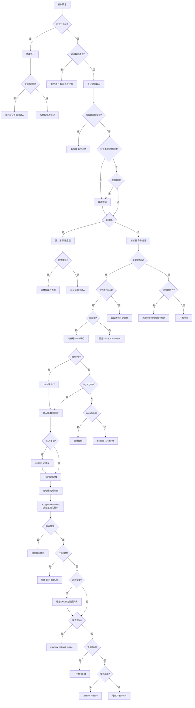
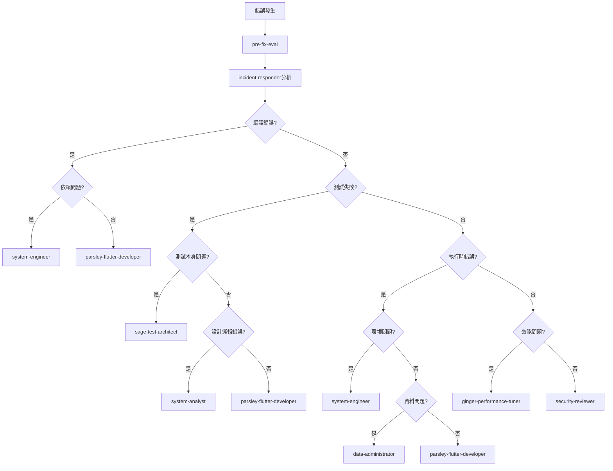
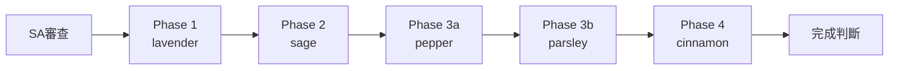

# 決策樹 Mermaid 圖表

本文件包含主線程決策樹的 Mermaid 視覺化圖表，供需要圖形化理解時參考。

> 決策樹規則本體：@.claude/rules/core/decision-tree.md

---

## 主流程圖（第負一層至第七層）

---

## 第六層：錯誤分類決策樹

---

## TDD 階段流程

---

**Last Updated**: 2026-02-06
**Source**: 從 decision-tree.md v4.3.0 附錄移出
