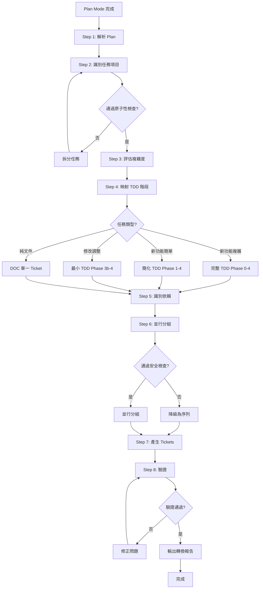

# Plan-to-Ticket 驗證和流程詳解

本文件包含 Plan-to-Ticket 轉換的驗證清單、輸出格式和完整流程圖。

> 主要流程：@.claude/pm-rules/plan-to-ticket-flow.md

---

## 驗證和輸出

### Step 8：產出驗證清單

轉換完成前，確保通過以下檢查：

```markdown
## Plan-to-Ticket 轉換驗證清單

- [ ] 所有 Plan 步驟已轉換為 Ticket
- [ ] 每個 Ticket 通過原子性檢查
- [ ] 依賴關係正確（無循環依賴）
- [ ] 並行分組安全（檔案無重疊、依賴無循環）
- [ ] TDD 階段映射正確
- [ ] 驗收條件符合 4V 原則
- [ ] Ticket ID 格式正確（版本-W{n}-{序號}）
- [ ] 所有必填欄位已填充
```

### 轉換報告格式

轉換完成後產出標準格式報告：

```markdown
## Plan-to-Ticket 轉換報告

### 轉換摘要
- **Plan 檔案**: {path}
- **產生 Ticket 數**: {count}
- **根任務**: {root_id}
- **Wave 分配**: W{start} ~ W{end}

### Ticket 清單
| ID | 標題 | 類型 | TDD 階段 | 依賴 | 可並行 |
|----|------|------|---------|------|--------|
| ... | ... | ... | ... | ... | ... |

### 依賴關係圖
（Mermaid 格式的依賴圖）

### 執行順序建議
1. Wave {n}：{ticket_ids}（並行執行）
2. Wave {n+1}：{ticket_ids}（序列執行）
3. ...
```

---

## 完整流程圖

Plan-to-Ticket 轉換的完整執行流程（Mermaid 格式）：



---

## 流程步驟說明

### Step 1-3：前置分析

| 步驟 | 輸入 | 輸出 | 檢查點 |
|------|------|------|--------|
| Step 1：解析 | Plan 檔案 | 結構化元素 | 檔案格式正確 |
| Step 2：識別 | 結構化元素 | 任務清單 | 任務通過原子性檢查 |
| Step 3：評估 | 任務清單 | 複雜度指數 | 高複雜度拆分 |

### Step 4-6：規劃階段

| 步驟 | 輸入 | 輸出 | 檢查點 |
|------|------|------|--------|
| Step 4：映射 | 任務類型+複雜度 | TDD 階段規劃 | 類型正確映射 |
| Step 5：依賴 | 任務清單 | 依賴矩陣 | 無循環依賴 |
| Step 6：分組 | 依賴矩陣 | Wave 分配 | 通過並行安全檢查 |

### Step 7-8：產出階段

| 步驟 | 輸入 | 輸出 | 檢查點 |
|------|------|------|--------|
| Step 7：產生 | Wave 規劃 | Ticket 檔案 | 欄位完整 |
| Step 8：驗證 | Ticket 檔案 | 轉換報告 | 通過驗證清單 |

---

## 常見轉換案例

### 案例 1：簡單功能轉換

**輸入**：
```
# 實作計畫：新增書籍評分

## 實作步驟
1. 建立 BookRating Entity
   - 修改檔案：lib/domain/entities/book_rating.dart

2. 實作 BookRatingRepository
   - 修改檔案：lib/infrastructure/repositories/book_rating_repository.dart
```

**TDD 映射**：新功能簡單 → 需要 Phase 1, 2, 3b, 4

**產出**：
```
0.31.0-W9-001：建立 BookRating Entity（Phase 1）
0.31.0-W9-002：實作 BookRatingRepository（Phase 3b）
```

### 案例 2：多步驟複雜功能

**TDD 映射**：新功能複雜 → 需要 SA 審查 + Phase 1-4

**Wave 分配**：
- W9：SA 審查（前置）
- W10：Phase 1 設計（可並行）
- W11：Phase 2 測試、Phase 3a 策略（序列）
- W12：Phase 3b 實作（序列）
- W13：Phase 4 重構（序列）

---

## 相關文件

- @.claude/pm-rules/plan-to-ticket-flow.md - Plan-to-Ticket 轉換流程（主要檔案）
- .claude/references/plan-to-ticket-mapping-details.md - 詳細映射規範
- @.claude/rules/guides/task-splitting.md - 任務拆分指南
- @.claude/rules/guides/parallel-dispatch.md - 並行派發指南

---

**Last Updated**: 2026-02-06
**Version**: 1.0.0
