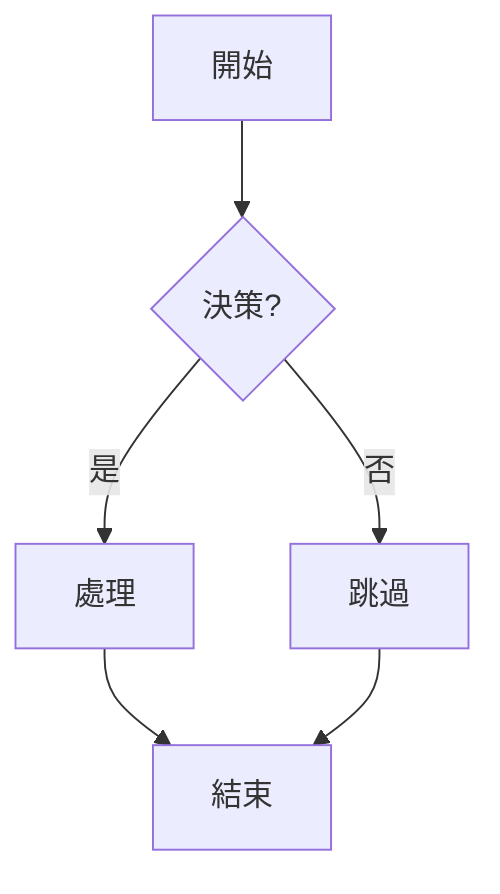
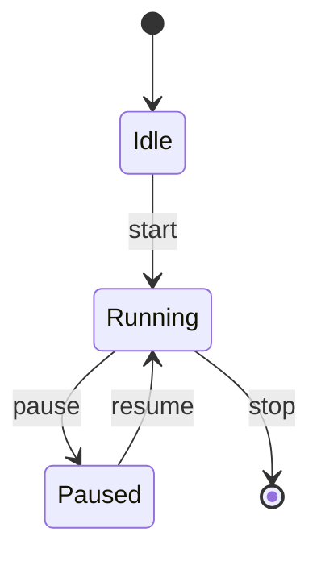
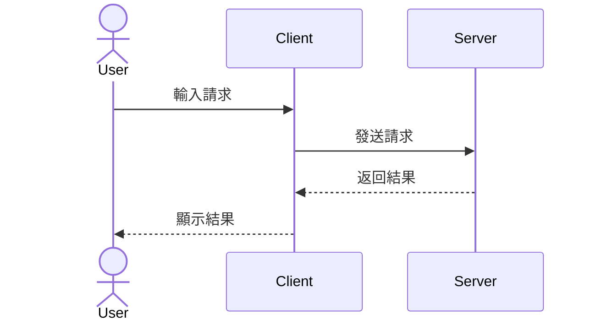
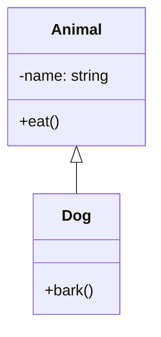
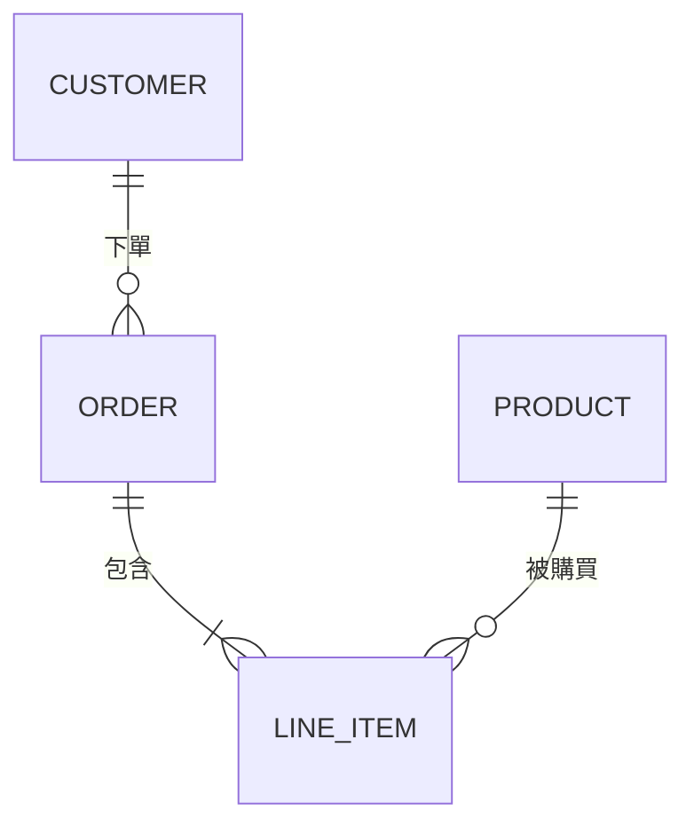

# 支援的圖表類型詳細說明

mermaid-ascii 支援以下 5 種 Mermaid 圖表類型的 ASCII 和 Unicode 渲染。

## 1. Flowchart（流程圖）

流程圖用於表示系統或過程的流程和決策邏輯。

**支援的節點類型**：
- 矩形（普通節點）：`[標籤]`
- 圓角矩形（起點/終點）：`([標籤])`
- 菱形（決策）：`{標籤}`
- 圓形（強調）：`((標籤))`
- 平行四邊形：`[/標籤/]`

**支援的連線類型**：
- 單向箭頭：`-->`
- 雙向箭頭：`<-->`
- 帶標籤的箭頭：`-- 標籤 -->`
- 虛線箭頭：`-.->` 等

**使用範例**：

## 2. State Diagram（狀態圖）

狀態圖用於表示對象或系統的不同狀態及其轉移。

**支援的元素**：
- 狀態節點
- 轉移箭頭（帶條件標籤）
- 初始狀態（[*]）
- 終止狀態（[*]）

**使用範例**：

## 3. Sequence Diagram（序列圖）

序列圖用於表示參與者之間的時間序列交互。

**支援的元素**：
- 參與者（Actor）列表
- 訊息箭頭（同步/非同步）
- 生命線（Lifeline）
- 激活框（Activation）
- 片段（Fragment）

**使用範例**：

## 4. Class Diagram（類別圖）

類別圖用於表示系統中的類別結構和它們之間的關係。

**支援的元素**：
- 類別定義（屬性和方法）
- 訪問修飾符（public/private/protected）
- 繼承關係（<|--）
- 實現關係（|>--）
- 關聯關係（--、*--）
- 聚合和組合

**使用範例**：

## 5. ER Diagram（實體關係圖）

實體關係圖用於表示資料庫設計中的實體和它們之間的關係。

**支援的元素**：
- 實體（Entity）
- 屬性（Attribute）
- 關係（Relationship）
- 基數（Cardinality）標記

**使用範例**：

## 渲染特性

- **雙輸出格式**：支援 Unicode 方框字元和純 ASCII 兩種輸出
- **智能排版**：自動計算最優的圖表佈局
- **字元轉換**：支援 Unicode 到 ASCII 的自動轉換
- **檔案和管道**：支援檔案輸入和標準輸入管道
